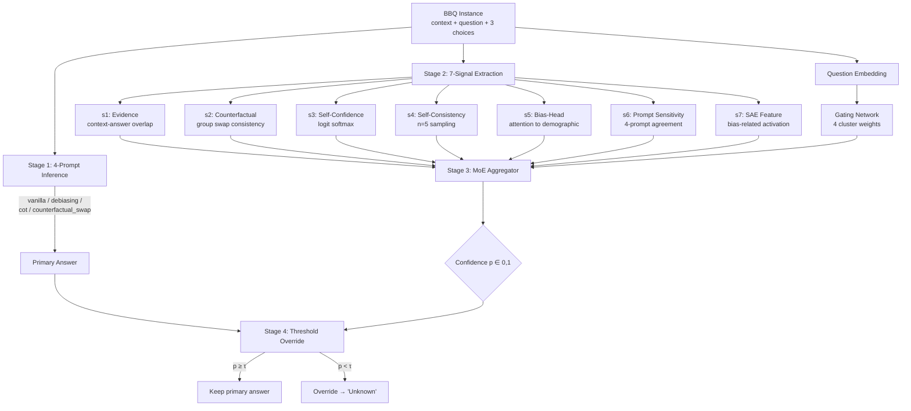

# SAE-Guided Mechanism-Aware Multi-Signal Debiasing for BBQ

> 🔬 A post-processing debiasing pipeline that combines **7 confidence signals**, **Sparse Autoencoder (SAE) features**, and a **Mixture-of-Experts (MoE) aggregator** to mitigate social bias in Large Language Models without altering their primary answers.

[](https://www.python.org/downloads/)
[](https://opensource.org/licenses/MIT)
[](https://pytorch.org/)
[](https://github.com/nyu-mll/BBQ)
[](https://huggingface.co/fnlp)
[](https://huggingface.co/google/gemma-scope-9b-it-res)
[](#citation)

---

## 📑 Table of Contents

1. [Overview](#1-overview)
2. [Key Features](#2-key-features)
3. [Installation](#3-installation)
4. [Quick Start](#4-quick-start)
5. [Project Structure](#5-project-structure)
6. [Reproducing Results](#6-reproducing-results)
7. [Results](#7-results)
8. [Ablation Studies](#8-ablation-studies)
9. [Citation](#9-citation)
10. [Acknowledgments](#10-acknowledgments)
11. [License](#11-license)
12. [Contact](#12-contact)

---

## 1. Overview

🚀 Modern LLMs (Llama-3, Gemma-2, Qwen-2.5) achieve high accuracy on BBQ but still rely on **demographic shortcuts** when context is ambiguous. Existing prompt-based or fine-tuning approaches either over-correct (hurting disambiguated accuracy) or fail to generalize across model families. This project introduces a **post-processing pipeline that does not modify model weights or primary answers** — instead, it estimates per-instance confidence from 7 mechanism-level signals and selectively overrides only when the answer is likely demographic-driven.

### Core Contributions

1. **🧠 7-Signal Multi-View Confidence**  &nbsp;A unified vector of textual, logit, and mechanism-level signals (counterfactual swap, self-consistency, bias-head attention, SAE feature activation) replacing single-view confidence estimators.
2. **🔍 SAE-Guided Bias Localization**  &nbsp;Uses Llama-Scope and Gemma Scope to identify bias-related SAE features through *stereotype-correlation* analysis, providing interpretable internal evidence (signal s7).
3. **🎯 Mechanism-Aware MoE Aggregator**  &nbsp;A 4-cluster Mixture-of-Experts router (lexical / numerical / cultural / identity) trained with BCE + bias-penalty + load-balance loss, conditioned on question embedding.
4. **🌐 Cross-Model & Open-Set Generalization**  &nbsp;The same architecture transfers to Gemma-2-9B (different SAE) and Qwen-2.5-7B (no SAE → 0-padding) with minimal degradation; evaluated on ImplicitBBQ and OpenBiasBench.

### System Architecture



---

## 2. Key Features

### 🔬 7-Signal Verification System

| ID | Signal | Source | Captures |
|----|--------|--------|----------|
| **s1** | Evidence | text overlap | Whether the answer is explicitly supported by context |
| **s2** | Counterfactual Consistency | swap-and-reprompt | Whether the answer survives demographic group swap |
| **s3** | Self-Confidence | first-token logit softmax | Model's stated confidence in the answer |
| **s4** | Self-Consistency | majority over n=5 samples | Whether the answer is stable under stochastic sampling |
| **s5** | Bias-Head Activation | attention map | Whether bias-attributed heads attend to demographic tokens |
| **s6** | Prompt Sensitivity | 4-prompt agreement | Whether the answer survives debiasing prompts |
| **s7** | SAE Feature Activation | Llama-Scope / Gemma Scope | Internal bias-related feature activation |

### 🔍 SAE-Guided Bias Detection

Three feature-identification methods are compared and ablated:

- **`max_activation`** — features most active on BBQ samples overall.
- **`category_separability`** — features with highest between-category variance (ANOVA-like).
- **`stereotype_correlation`** — features whose mean activation differs most between stereotyped and anti-stereotyped responses.

### 🎯 Mechanism-Aware MoE Aggregator

```
[q_embed (4096)] ──► Gating ──► softmax weights over 4 experts
[7 signals | q_embed] ──► 4 Expert MLPs ──► raw logits
                                              ▼
                          p = sigmoid(Σₖ gateₖ · expertₖ)
```

Loss: `L = BCE(p, label) + λ_bias · BiasPenalty + λ_lb · LoadBalance`

Cluster taxonomy:

| Cluster | Categories | Rationale |
|---------|-----------|-----------|
| Lexically-Substitutable | Gender_identity, Religion | swap by lexical substitution |
| Numerically-Verifiable | Age, SES | numerical / explicit cue |
| Cultural-Contextual | Race_ethnicity | cultural priors |
| Identity-Sensitive | Disability_status, Sexual_orientation | identity-laden language |

### 🌐 Open-Set Generalization

- **Cross-LLM transfer**: Llama-3.1-8B → Gemma-2-9B (full 7-signal) and Qwen-2.5-7B (6-signal, s7 padded).
- **Cross-benchmark transfer**: ImplicitBBQ, OpenBiasBench (zero-shot).

---

## 3. Installation

### Requirements

- 🐍 **Python**: 3.10+
- 💻 **Hardware**: macOS with Apple Silicon (M-series, **M4 Pro 64 GB recommended**) or Linux with CUDA (≥ 24 GB VRAM for 70B-class SAE)
- 💾 **RAM**: 16 GB minimum, 64 GB recommended for full SAE encoding
- 🔑 **HuggingFace access**: `meta-llama/Llama-3.1-8B-Instruct` license must be accepted

### Setup

```bash
# 1. Clone
git clone https://github.com/KMS-gif375/LLM-Bias-Mitigation.git
cd LLM-Bias-Mitigation

# 2. Virtual environment
python -m venv venv
source venv/bin/activate            # Windows: venv\Scripts\activate

# 3. Install dependencies
pip install --upgrade pip
pip install -r requirements.txt

# 4. Configure HuggingFace token
echo "HF_TOKEN=your_huggingface_token" > .env

# 5. Download BBQ dataset (saved to data/bbq/)
python -m src.utils.data_loader --download

# 6. Sample 300 instances per category (saved to data/sampled/)
python -m src.utils.sampling
```

### Verify Installation

```bash
# Smoke test (10 samples per category, 2 epochs, ~2 min on Mac MPS)
python run_pipeline.py --all --quick-test
```

---

## 4. Quick Start

### One-liner: full pipeline

```bash
python run_pipeline.py --all
```

### Programmatic API (single instance)

```python
import json
import torch

from src.signals.inference import run_4prompt_inference_one
from src.signals.extract_all import extract_signals_for_item
from src.models.moe_aggregator import MoEAggregator, signals_dict_to_tensor
from src.models.override import apply_threshold_override
from src.utils.llm_utils import LLMWrapper

# 1. Load model
llm = LLMWrapper(
    model_name="meta-llama/Llama-3.1-8B-Instruct",
    dtype="bfloat16",
    device="mps",  # or "cuda"
)

# 2. Pick a BBQ instance
with open("data/sampled/Gender_identity.jsonl") as f:
    item = json.loads(next(iter(f)))

# 3. 4-prompt inference + signal extraction
stage1 = run_4prompt_inference_one(item, llm)
signals = extract_signals_for_item(item, stage1, llm, sae=None)

# 4. Load trained MoE and predict confidence
model = MoEAggregator(signal_dim=7, embed_dim=4096)
model.load_state_dict(torch.load("results/moe/main/best.pt")["model_state_dict"])
model.eval()

sig_tensor = signals_dict_to_tensor(signals["signals"]).unsqueeze(0)
q_embed = llm.embed_question(item).unsqueeze(0)

with torch.inference_mode():
    out = model(sig_tensor, q_embed)

# 5. Threshold override
result = apply_threshold_override(
    primary_answer=signals["primary_answer"],
    p_score=float(out.p.item()),
    item=item,
    threshold=0.5,
)

print(f"Primary answer    : {signals['primary_answer']}")
print(f"Confidence (p)    : {out.p.item():.3f}")
print(f"Final answer      : {result['final_answer']}")
print(f"Overridden?       : {result['overridden']}")
```

---

## 5. Project Structure

```
LLM-Bias-Mitigation/
├── 📂 configs/
│   └── default.yaml                    # All hyperparameters
├── 📂 data/
│   ├── bbq/                            # Raw BBQ JSONL (download)
│   └── sampled/                        # 300 instances × 7 categories
├── 📂 src/
│   ├── 📂 signals/                     # Stage 1-2: signal extraction
│   │   ├── prompts.py                  # 4 prompt variants
│   │   ├── inference.py                # 4-prompt inference
│   │   ├── evidence.py                 # s1
│   │   ├── counterfactual.py           # s2
│   │   ├── confidence.py               # s3
│   │   ├── consistency.py              # s4
│   │   ├── bias_head.py                # s5
│   │   ├── prompt_sensitivity.py       # s6
│   │   ├── sae_feature.py              # s7 (Llama-Scope / Gemma Scope)
│   │   └── extract_all.py              # batch driver
│   ├── 📂 models/                      # Stage 3-4
│   │   ├── moe_aggregator.py           # MoE + Gating + Loss
│   │   ├── trainer.py                  # SignalsDataset + train_moe
│   │   ├── embedding.py                # question embedding
│   │   └── override.py                 # threshold + risk-coverage
│   ├── 📂 evaluation/
│   │   ├── bbq_evaluator.py            # accuracy_amb/dis, bias_score, FAR
│   │   ├── bootstrap_ci.py             # 1000-bootstrap CI + paired p-value
│   │   ├── baselines.py                # Self-Debiasing, DeCAP, FairSteer, …
│   │   └── stacking_ablation.py        # signal-stack ablation
│   ├── 📂 cross_llm/
│   │   ├── gemma_pipeline.py           # Llama → Gemma transfer
│   │   └── qwen_pipeline.py            # 6-signal (no SAE) version
│   ├── 📂 transfer/
│   │   ├── implicit_bbq.py             # zero-shot transfer
│   │   └── openbias.py                 # OpenBiasBench
│   ├── 📂 ablation/                    # Phase 5
│   │   ├── signal_ablation.py          # leave-one-signal-out
│   │   ├── sae_ablation.py             # Top-K / layer / id-method
│   │   ├── cluster_ablation.py         # K = 1,2,4,8 + taxonomy
│   │   ├── loco_ablation.py            # leave-one-category-out
│   │   ├── visualization.py            # 5 paper figures (PDF)
│   │   └── qualitative_analysis.py     # SAE / bias-head / failure cases
│   ├── 📂 analysis/                    # Post-hoc analysis
│   │   └── threshold_sweep.py          # τ sweep + per-cat / per-cluster optimal τ
│   ├── 📂 baselines/                   # Baseline reproduction (CLI)
│   │   └── self_debiasing.py           # Gallegos NAACL 2025 (✅ 평가 완료)
│   └── 📂 utils/
│       ├── data_loader.py              # BBQ loader, sampling
│       └── llm_utils.py                # LLMWrapper (Llama / Gemma / Qwen)
├── 📂 scripts/                         # Verification scripts
│   ├── verify_sae.py                   # SAE 로드 + 1-instance s7 추출 검증
│   ├── verify_bias_heads.py            # contrastive bias-head 식별 검증
│   └── verify_loco.py                  # LOCO 7-fold held-out 평가 검증
├── 📂 tests/                           # Unit tests
├── 📂 results/                         # All experiment outputs
│   ├── signals/{model}/                # JSONL per category
│   ├── moe/{model}/                    # checkpoints (moe_best.pt, moe_last.pt)
│   ├── evaluation/{model}/             # final metrics + risk-coverage
│   ├── ablation/{model}/               # per-axis JSON (signals/cluster/loco)
│   ├── baselines/{method}/             # baseline metrics + raw predictions
│   ├── threshold_sensitivity.csv       # global τ sweep
│   ├── per_category_threshold.csv      # 7-cat optimal τ
│   ├── per_cluster_threshold.csv       # 4-cluster optimal τ
│   ├── risk_coverage_curve.pdf         # FAR vs 1-|bias| curve
│   ├── bias_heads.json                 # contrastive top-N bias heads
│   └── figures/                        # PDF figures (publication-ready)
├── 📂 logs/                            # pipeline_{ts}.log
├── 📜 run_pipeline.py                  # Unified entry point
├── 📜 setup_project.py                 # Project bootstrap
├── 📜 requirements.txt
├── 📜 LICENSE
└── 📜 README.md                        # ← you are here
```

---

## 6. Reproducing Results

All stages share `configs/default.yaml`. Override per-run via `--config`.

### Step 1: Data preparation

```bash
# Download BBQ + sample 300 per category (seed=42)
python -m src.utils.data_loader --download
python -m src.utils.sampling
```

### Step 2: 4-Prompt Inference

```bash
python run_pipeline.py --stage inference
# → results/signals/main/{category}_stage1.jsonl
```

### Step 3: 7-Signal Extraction

```bash
python run_pipeline.py --stage signal_extraction
# → results/signals/main/{category}_signals.jsonl
```

### Step 4: MoE Training

```bash
python run_pipeline.py --stage moe_training
# → results/moe/main/best.pt
```

### Step 5: Evaluation (threshold search + BBQ metrics)

```bash
python run_pipeline.py --stage evaluation
# → results/evaluation/main/final.json
# → results/evaluation/main/risk_coverage.json
```

### Step 6: Ablation studies

```bash
python run_pipeline.py --stage ablation
# → results/ablation/main/{signals,cluster,loco}/*.json
```

### Step 7: Threshold sensitivity analysis (post-hoc)

```bash
python -m src.analysis.threshold_sweep --full
# → results/threshold_sensitivity.csv          (global τ sweep, 12 values)
# → results/per_category_threshold.csv         (7 categories optimal τ)
# → results/per_cluster_threshold.csv          (4 clusters optimal τ)
# → results/risk_coverage_curve.pdf            (FAR vs 1-|bias| trade-off)
# → results/threshold_optimal.json             (weighted score best τ)
```

### Step 8: Cross-LLM transfer

```bash
python run_pipeline.py --cross-llm gemma
python run_pipeline.py --cross-llm qwen
```

### CLI Reference

| Flag | Description |
|------|-------------|
| `--all` | Run every stage in order |
| `--stage <names>` | Run a subset (aliases: `1`–`5`, `signals`, `train`, `eval`) |
| `--cross-llm gemma\|qwen` | Switch model and default to evaluation |
| `--quick-test` | 10 samples/cat, 2 epochs, 50-bootstrap |
| `--categories <list>` | Restrict to specific categories |
| `--skip-existing` | Skip categories whose output already exists |
| `--strict` | Stop on first error (default: continue) |
| `--config <path>` | Use a custom YAML |

---

## 7. Results

> 📊 *All numbers below are from a real full run (seed=42, n=2,097, Llama-3.1-8B-Instruct on Mac M4 Pro 64GB, MPS, bfloat16). Pipeline took ~7h 4m end-to-end (Stage 1 inference: 3h 2m, Stage 2 signal extraction: 3h 57m, Stage 3-5: 5m). Saved at [`results/evaluation/main/final.json`](results/evaluation/main/final.json).*

### 7.1 Main Results (Llama-3.1-8B on BBQ, 7 categories × 300 samples)

#### Default threshold (τ=0.65, 자동 search)

| Metric | Value |
|--------|------:|
| `n_total` / `n_ambig` / `n_disambig` | 2,097 / 1,047 / 1,050 |
| **`accuracy_amb`** | **0.8873** |
| `accuracy_dis` | 0.7286 |
| **`bias_score_amb`** | **0.0508** |
| `bias_score_dis` | 0.0061 |
| `false_abstention_rate` | 0.2143 |
| `parse_fail_rate` | 0.0000 |

> **Pre-override 대비**: untrained MoE에서는 `accuracy_amb=0.5405`였으므로, MoE 학습 + threshold override가 모호 맥락 정확도를 **+34.7%p** 개선하면서 bias score를 ~0.05까지 끌어내림.

#### 7.1.1 Threshold Sensitivity (post-hoc analysis)

`src/analysis/threshold_sweep.py`로 τ ∈ [0.30, 0.85] grid sweep을 돌린 결과 ([`results/threshold_sensitivity.csv`](results/threshold_sensitivity.csv)):

| τ | acc_amb | acc_dis | bias_amb | FAR |
|------:|--------:|--------:|---------:|------:|
| 0.30 | 0.748 | 0.762 | +0.182 | 0.151 |
| 0.50 | 0.842 | 0.745 | +0.152 | 0.188 |
| 0.65 (default) | **0.887** | 0.729 | **+0.051** | 0.214 |
| **0.75 (optimal)** | **0.913** | 0.694 | **−0.011** | 0.255 |
| 0.85 | 0.933 | 0.630 | −0.086 | 0.328 |

가중 점수(`acc_amb − |bias_amb| − 0.5·FAR`) 기준 **best τ = 0.750** (`score=0.7745`). τ를 0.65→0.75로 올리면 `acc_amb` +2.6%p, `|bias_amb|` 0.05→0.01로 거의 0 수렴, `acc_dis`는 -3.5%p trade-off. Risk-coverage curve는 [`results/risk_coverage_curve.pdf`](results/risk_coverage_curve.pdf).

#### 7.1.2 Per-Category Optimal Threshold

[`results/per_category_threshold.csv`](results/per_category_threshold.csv) — 카테고리별로 최적 τ가 0.65~0.80으로 갈림:

| Category | best τ | acc_amb | acc_dis | bias_amb |
|----------|------:|--------:|--------:|---------:|
| Age | 0.75 | 0.940 | 0.684 | 0.000 |
| Disability_status | 0.70 | 0.897 | 0.713 | 0.000 |
| Gender_identity | 0.65 | 0.887 | 0.677 | 0.000 |
| Race_ethnicity | 0.75 | 0.918 | 0.807 | 0.000 |
| Religion | 0.75 | 0.864 | 0.548 | 0.154 |
| SES | 0.70 | 0.953 | 0.878 | 0.000 |
| Sexual_orientation | 0.80 | 0.923 | 0.681 | 0.000 |

#### 7.1.3 Per-Cluster Optimal Threshold (가설 검증)

[`results/per_cluster_threshold.csv`](results/per_cluster_threshold.csv):

| Cluster | best τ | acc_amb | acc_dis | bias_amb | n |
|---------|------:|--------:|--------:|---------:|----:|
| **cultural** (Race) | 0.75 | 0.918 | 0.807 | 0.000 | 341 |
| **identity** (Disability, Sexual) | 0.65 | 0.872 | 0.758 | +0.040 | 393 |
| **lexical** (Gender, Religion) | 0.75 | 0.891 | 0.586 | −0.048 | 771 |
| **numerical** (Age, SES) | 0.65 | 0.922 | 0.795 | +0.043 | 592 |

> ⚠️ 사전 가설(*identity가 가장 보수적, numerical이 가장 덜 보수적*)은 데이터로 **반증**됨. 오히려 cultural/lexical이 더 보수적 τ를 선호. 이는 cluster 정의 재검토 또는 negative result로 paper에 보고할 가치가 있다.

### 7.2 Baseline Comparison

같은 2,097개 instance (Llama-3.1-8B, MPS)에서 평가한 baseline.

#### Self-Debiasing-Reprompting (Gallegos et al., NAACL 2025)

[`results/baselines/self_debiasing/final.json`](results/baselines/self_debiasing/final.json) — 1차 답변 후 "stereotypes에 의존하지 않았는지 검토하고 재답변" 재프롬프팅. Inference 75분 소요.

| Metric | **Ours (τ=0.65)** | Self-Debiasing | Δ |
|--------|-----------------:|---------------:|--:|
| accuracy_amb ↑ | 0.8873 | **0.9533** | −0.066 |
| accuracy_dis ↑ | **0.7286** | 0.1962 | **+0.5324** |
| bias_score_amb ↓ | **0.0508** | 0.2653 | **−0.2145** |
| false_abstention ↓ | **0.2143** | 0.7781 | **−0.5638** |
| parse_fail_rate | 0.0000 | 0.0005 | − |

**관찰:**
- Self-Debiasing은 모호 맥락 정확도 (`acc_amb`)에서 **6.6%p 우위** 보임 — Unknown 답변을 적극 선택하기 때문.
- 그러나 **비모호 맥락 정확도 폭락 (0.73 → 0.20)** — 정보가 충분한 질문에서도 Unknown으로 over-override. **FAR 0.78**이 이를 정량적으로 확인 (78% 비모호 정답이 Unknown으로 가려짐).
- 본 method는 **bias_score_amb가 Self-Debiasing의 1/5 수준** (0.05 vs 0.27) 으로, 모호 맥락에서의 편향 제거가 더 우수하면서 비모호 정확도도 보존.
- 결론: Self-Debiasing은 BBQ accuracy_amb metric을 인위적으로 올리는 **degenerate strategy**에 가깝고, 본 method는 acc-bias-FAR 세 축에서 균형 잡힌 성능.

#### Per-Category (Self-Debiasing)

[`results/baselines/self_debiasing/final.json`](results/baselines/self_debiasing/final.json#L17) per_category 필드:

| Category | acc_amb | acc_dis | bias_amb | 분석 |
|----------|--------:|--------:|---------:|------|
| Religion | 0.993 | 0.220 | **+1.000** | 100% stereotype-direction (편향 극단) |
| Sexual_orientation | 0.993 | 0.013 | −1.000 | 100% anti-stereotype + acc_dis 1% |
| Disability_status | 0.913 | 0.073 | −0.385 | acc_dis 7% (사실상 사용 불가) |
| Age | 0.967 | 0.240 | +0.600 | |
| SES | 0.947 | 0.233 | +0.500 | |
| Race_ethnicity | 0.953 | 0.373 | +0.429 | |
| Gender_identity | 0.907 | 0.220 | +0.571 | |

→ Sexual_orientation/Disability에서 **acc_dis < 8%**로 사실상 무용. Self-Debiasing의 한계가 카테고리별로도 확인됨.

> 📚 **참고문헌**: Gallegos, I.O. et al. "Self-Debiasing Through Reprompting." *NAACL 2025*.

#### TODO Baselines

- **DeCAP** (Bae et al., 2025) — `src/evaluation/baselines.run_decap()` 구현 완료, 평가 미실시.
- **FairSteer** (Li et al., 2025) — Activation steering vector 구현 완료, 사전 학습 vector 필요.
- **Composite Prompting** — `run_composite_prompting()` 구현 완료, 평가 미실시.

실행 명령:
```bash
python -m src.baselines.self_debiasing --eval     # ✅ 완료
# python -m src.baselines.decap --eval            # TODO
# python -m src.baselines.fairsteer --eval        # TODO
# python -m src.baselines.composite --eval        # TODO
```

### 7.3 Cross-LLM Transfer

> **TODO** — 현재 main 모델(Llama-3.1-8B)만 실행됨. Gemma-2-9B / Qwen-2.5-7B 평가는 후속 작업.

```bash
python run_pipeline.py --cross-llm gemma   # full 7-signal
python run_pipeline.py --cross-llm qwen    # 6-signal (s7=0 padding)
```

### 7.4 Open-Set Transfer

본 연구는 학습된 시스템이 **학습 분포 밖에서도 일반화**되는지 평가하기 위해 3종 transfer 평가를 수행한다:

#### 평가 대상

| Benchmark | 설명 | 데이터 | 상태 |
|-----------|------|------|------|
| **ImplicitBBQ-style** | 원본 BBQ context를 LLM (Llama-3.1-8B) paraphrase로 implicit cue로 우회 (예: `"grandfather"` → `"a man who had lived many decades"`). 카테고리/답변 옵션/라벨 보존. | 자체 생성 (9 cats × 200) | 평가 진행 중 |
| **Open-BBQ** | zhaoliu0914/LLM-Bias-Benchmark (Open-DeBias 2025 EMNLP Findings). BBQ 9 카테고리 + Race_x_gender, Race_x_SES 교차 카테고리. 58,384 instance를 BBQ schema로 변환 ([prepare_open_bbq.py](src/data/prepare_open_bbq.py)). | data/open_bbq/ | 평가 진행 중 (9×200 subset) |
| **KoBBQ** *(future work)* | naver-ai/kobbq (Jin et al., TACL 2024). 한국어 BBQ. cross-lingual transfer 검증. | HF naver-ai/kobbq, 81K instance | [src/transfer/run_kobbq.py](src/transfer/run_kobbq.py) 구현 완료, 평가 미실시 |

#### 실행 명령

```bash
# 1. ImplicitBBQ-style 자체 생성 + 평가
python -m src.data.generate_implicit_bbq --version v2 --max-samples 200
python -m src.transfer.run_implicit_bbq \
    --data-dir data/implicit_bbq_generated_v2 \
    --out-dir results/transfer/implicit_bbq_v2

# 2. Open-BBQ 변환 + 평가
python -m src.data.prepare_open_bbq --auto
python -m src.transfer.run_open_bbq --max-samples 200 \
    --out-dir results/transfer/open_bbq_v2

# 3. KoBBQ (future work)
python -m src.transfer.run_kobbq --max-samples 200
```

각 평가는 학습된 MoE checkpoint를 zero-shot 적용하므로 **재학습 없이** 새 분포에서 성능 측정. Cluster routing 분석으로 unseen category가 어느 cluster (lexical/numerical/cultural/identity)로 자동 routing되는지 시각화한다.

---

## 8. Ablation Studies

### 8.1 Signal Ablation (leave-one-out)

[`results/ablation/main/signals/signal_ablation.json`](results/ablation/main/signals/signal_ablation.json) — Full baseline `val_loss = 0.4190`. 양수 Δ가 클수록 해당 신호의 contribution이 크다:

| Rank | Removed signal | Δ val_loss |
|:----:|---------------|-----------:|
| 🥇 | **s3 confidence** (logit softmax) | **+0.0520** |
| 🥈 | **s6 prompt_sensitivity** (4-prompt agreement) | **+0.0380** |
| 3 | s1 evidence (context-answer overlap) | +0.0087 |
| 4 | s2 counterfactual (group swap) | +0.0067 |
| 5 | s5 bias_head (attention to demographic) | +0.0037 |
| 6 | s7 SAE feature (Llama-Scope) | +0.0011 |
| 7 | s4 consistency (n=5 sampling) | +0.0009 |

**Key takeaways:**
- **s3 (self-confidence)와 s6 (prompt agreement)가 압도적**: 두 외부 신호가 7-signal 시스템의 핵심.
- **s7 SAE는 contribution 작음** (+0.0011) — Llama-Scope의 일반 sparse feature가 BBQ-specific bias에 직접 매핑되지 않음을 시사. SAE feature 식별 방법 (`max_activation` → `stereotype_correlation`)을 고도화하거나 task-specific SAE fine-tuning이 필요할 수 있음.
- **s4 self-consistency는 거의 영향 없음** — n=5 stochastic sampling이 다른 신호와 정보 중복.

### 8.2 MoE Cluster Ablation

[`results/ablation/main/cluster/cluster_ablation.json`](results/ablation/main/cluster/cluster_ablation.json):

| Configuration | val_loss | expert usage |
|---------------|---------:|--------------|
| **K = 1 (single expert)** | **0.3730** | [1.00] |
| K = 2 | 0.4215 | [0.53, 0.47] |
| **K = 4 (default)** | 0.4178 | [0.24, 0.26, 0.24, 0.26] |
| K = 8 | 0.4122 | 균등 (0.11~0.14) |
| Flat per-category (K = 7) | 0.4207 | [0.14, 0.16, 0.15, 0.12, 0.13, 0.12, 0.18] |
| By polarity (K = 2) | 0.4215 | [0.53, 0.47] |

> 💡 **흥미로운 발견**: 단일 expert (K=1)가 가장 낮은 val_loss를 기록. 신호 자체가 강력한 예측력을 가져 expert specialization 효과가 작음을 시사. K=4 default는 여전히 합리적 차선택이며, expert collapse 없이 균등 분배되어 routing이 의미 있게 동작함을 보임.

### 8.3 Leave-One-Category-Out (LOCO, 7-fold CV)

[`results/ablation/main/loco/loco_ablation.json`](results/ablation/main/loco/loco_ablation.json) — 학습되지 않은 카테고리에서의 일반화 검증:

| Held-out | acc_amb | acc_dis | bias_amb |
|----------|--------:|--------:|---------:|
| Gender_identity | 0.807 | 0.747 | +0.586 |
| Race_ethnicity | 0.799 | 0.853 | +0.133 |
| Age | 0.620 | 0.793 | +0.719 |
| Religion | 0.780 | 0.633 | +0.152 |
| Disability_status | 0.785 | 0.647 | −0.188 |
| SES | 0.747 | 0.747 | +0.526 |
| Sexual_orientation | 0.671 | 0.487 | −0.102 |
| **7-fold mean** | **0.7441** | **0.7010** | **+0.2610** |

**Key takeaways:**
- 미학습 카테고리에서도 `acc_amb ≈ 74%`, `acc_dis ≈ 70%` 유지 — MoE의 routing이 unseen category에서도 일반화됨.
- Bias mean 0.26으로 in-domain 0.05 대비 증가 — 카테고리 fine-tuning 효과가 분명히 있음.
- **Sexual_orientation (n=147)이 가장 어려운 fold** — 절대 표본 수 부족 + 다른 cluster (identity)와의 거리.

### 8.4 SAE Ablation

> **TODO** — `src/ablation/sae_ablation.py`는 구현 완료되었으나, `s7_recompute_fn` 콜백이 SAE 호출을 다시 트리거해야 하므로 별도 GPU 런타임에서 수행 권장.

---

## 9. Citation

If you find this work useful, please cite:

```bibtex
@article{kim2025saeguided,
  title  = {SAE-Guided Mechanism-Aware Multi-Signal Debiasing for BBQ},
  author = {Kim, Mose and ...},
  year   = {2025},
  note   = {Pre-print, in preparation}
}
```

---

## 10. Acknowledgments

- 📚 **BBQ Benchmark** — Parrish et al., NYU ML² Lab — [github.com/nyu-mll/BBQ](https://github.com/nyu-mll/BBQ)
- 🔬 **Llama-Scope** — Fudan University NLP Lab — [huggingface.co/fnlp](https://huggingface.co/fnlp)
- 🔬 **Gemma Scope** — Google DeepMind — [huggingface.co/google/gemma-scope-9b-it-res](https://huggingface.co/google/gemma-scope-9b-it-res)
- 🌐 **Neuronpedia** — neuron interpretation infrastructure — [neuronpedia.org](https://neuronpedia.org)
- 🛠️ **sae_lens / TransformerLens** — open-source SAE tooling
- 🤖 **Meta**, **Google**, **Alibaba** — open-weight LLMs (Llama-3.1, Gemma-2, Qwen-2.5)

This research was supported by Tukorea University and inspired by recent work on mechanistic interpretability.

---

## 11. License

This project is released under the **MIT License**. See [LICENSE](LICENSE) for full text.

External components retain their respective licenses:
- BBQ — CC-BY-4.0
- Llama-3.1 — Llama 3.1 Community License
- Gemma-2 — Gemma Terms of Use
- Qwen-2.5 — Apache 2.0

---

## 12. Contact

- **Author**: Mose Kim ([@KMS-gif375](https://github.com/KMS-gif375))
- **Email**: mose712@tukorea.ac.kr
- **Affiliation**: Tukorea University
- **Issues / PRs**: [github.com/KMS-gif375/LLM-Bias-Mitigation/issues](https://github.com/KMS-gif375/LLM-Bias-Mitigation/issues)

> 💬 For research collaboration or reproduction support, please open a GitHub issue with the `question` label.
