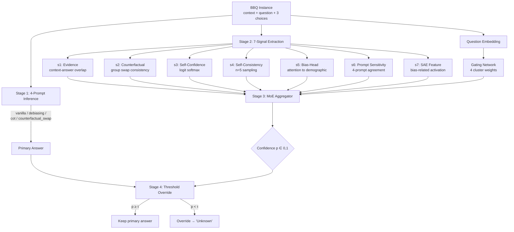

# SAE-Guided Mechanism-Aware Multi-Signal Debiasing for BBQ

> 🔬 A post-processing debiasing pipeline that combines **7 confidence signals**, **Sparse Autoencoder (SAE) features**, and a **Mixture-of-Experts (MoE) aggregator** to mitigate social bias in Large Language Models without altering their primary answers.

[](https://www.python.org/downloads/)
[](https://opensource.org/licenses/MIT)
[](https://pytorch.org/)
[](https://github.com/nyu-mll/BBQ)
[](https://huggingface.co/fnlp)
[](https://huggingface.co/google/gemma-scope-9b-it-res)
[](#citation)

---

## 📑 Table of Contents

1. [Overview](#1-overview)
2. [Key Features](#2-key-features)
3. [Installation](#3-installation)
4. [Quick Start](#4-quick-start)
5. [Project Structure](#5-project-structure)
6. [Reproducing Results](#6-reproducing-results)
7. [Results](#7-results)
8. [Ablation Studies](#8-ablation-studies)
9. [Citation](#9-citation)
10. [Acknowledgments](#10-acknowledgments)
11. [License](#11-license)
12. [Contact](#12-contact)

---

## 1. Overview

🚀 Modern LLMs (Llama-3, Gemma-2, Qwen-2.5) achieve high accuracy on BBQ but still rely on **demographic shortcuts** when context is ambiguous. Existing prompt-based or fine-tuning approaches either over-correct (hurting disambiguated accuracy) or fail to generalize across model families. This project introduces a **post-processing pipeline that does not modify model weights or primary answers** — instead, it estimates per-instance confidence from 7 mechanism-level signals and selectively overrides only when the answer is likely demographic-driven.

### Core Contributions

1. **🧠 7-Signal Multi-View Confidence**  &nbsp;A unified vector of textual, logit, and mechanism-level signals (counterfactual swap, self-consistency, bias-head attention, SAE feature activation) replacing single-view confidence estimators.
2. **🔍 SAE-Guided Bias Localization**  &nbsp;Uses Llama-Scope and Gemma Scope to identify bias-related SAE features through *stereotype-correlation* analysis, providing interpretable internal evidence (signal s7).
3. **🎯 Mechanism-Aware MoE Aggregator**  &nbsp;A 4-cluster Mixture-of-Experts router (lexical / numerical / cultural / identity) trained with BCE + bias-penalty + load-balance loss, conditioned on question embedding.
4. **🌐 Cross-Model & Open-Set Generalization**  &nbsp;The same architecture transfers to Gemma-2-9B (different SAE) and Qwen-2.5-7B (no SAE → 0-padding) with minimal degradation; evaluated on ImplicitBBQ and OpenBiasBench.

### System Architecture



---

## 2. Key Features

### 🔬 7-Signal Verification System

| ID | Signal | Source | Captures |
|----|--------|--------|----------|
| **s1** | Evidence | text overlap | Whether the answer is explicitly supported by context |
| **s2** | Counterfactual Consistency | swap-and-reprompt | Whether the answer survives demographic group swap |
| **s3** | Self-Confidence | first-token logit softmax | Model's stated confidence in the answer |
| **s4** | Self-Consistency | majority over n=5 samples | Whether the answer is stable under stochastic sampling |
| **s5** | Bias-Head Activation | attention map | Whether bias-attributed heads attend to demographic tokens |
| **s6** | Prompt Sensitivity | 4-prompt agreement | Whether the answer survives debiasing prompts |
| **s7** | SAE Feature Activation | Llama-Scope / Gemma Scope | Internal bias-related feature activation |

### 🔍 SAE-Guided Bias Detection

Three feature-identification methods are compared and ablated:

- **`max_activation`** — features most active on BBQ samples overall.
- **`category_separability`** — features with highest between-category variance (ANOVA-like).
- **`stereotype_correlation`** — features whose mean activation differs most between stereotyped and anti-stereotyped responses.

### 🎯 Mechanism-Aware MoE Aggregator

```
[q_embed (4096)] ──► Gating ──► softmax weights over 4 experts
[7 signals | q_embed] ──► 4 Expert MLPs ──► raw logits
                                              ▼
                          p = sigmoid(Σₖ gateₖ · expertₖ)
```

Loss: `L = BCE(p, label) + λ_bias · BiasPenalty + λ_lb · LoadBalance`

Cluster taxonomy:

| Cluster | Categories | Rationale |
|---------|-----------|-----------|
| Lexically-Substitutable | Gender_identity, Religion | swap by lexical substitution |
| Numerically-Verifiable | Age, SES | numerical / explicit cue |
| Cultural-Contextual | Race_ethnicity | cultural priors |
| Identity-Sensitive | Disability_status, Sexual_orientation | identity-laden language |

### 🌐 Open-Set Generalization

- **Cross-LLM transfer**: Llama-3.1-8B → Gemma-2-9B (full 7-signal) and Qwen-2.5-7B (6-signal, s7 padded).
- **Cross-benchmark transfer**: ImplicitBBQ, OpenBiasBench (zero-shot).

---

## 3. Installation

### Requirements

- 🐍 **Python**: 3.10+
- 💻 **Hardware**: macOS with Apple Silicon (M-series, **M4 Pro 64 GB recommended**) or Linux with CUDA (≥ 24 GB VRAM for 70B-class SAE)
- 💾 **RAM**: 16 GB minimum, 64 GB recommended for full SAE encoding
- 🔑 **HuggingFace access**: `meta-llama/Llama-3.1-8B-Instruct` license must be accepted

### Setup

```bash
# 1. Clone
git clone https://github.com/KMS-gif375/LLM-Bias-Mitigation.git
cd LLM-Bias-Mitigation

# 2. Virtual environment
python -m venv venv
source venv/bin/activate            # Windows: venv\Scripts\activate

# 3. Install dependencies
pip install --upgrade pip
pip install -r requirements.txt

# 4. Configure HuggingFace token
echo "HF_TOKEN=your_huggingface_token" > .env

# 5. Download BBQ dataset (saved to data/bbq/)
python -m src.utils.data_loader --download

# 6. Sample 300 instances per category (saved to data/sampled/)
python -m src.utils.sampling
```

### Verify Installation

```bash
# Smoke test (10 samples per category, 2 epochs, ~2 min on Mac MPS)
python run_pipeline.py --all --quick-test
```

---

## 4. Quick Start

### One-liner: full pipeline

```bash
python run_pipeline.py --all
```

### Programmatic API (single instance)

```python
import json
import torch

from src.signals.inference import run_4prompt_inference_one
from src.signals.extract_all import extract_signals_for_item
from src.models.moe_aggregator import MoEAggregator, signals_dict_to_tensor
from src.models.override import apply_threshold_override
from src.utils.llm_utils import LLMWrapper

# 1. Load model
llm = LLMWrapper(
    model_name="meta-llama/Llama-3.1-8B-Instruct",
    dtype="bfloat16",
    device="mps",  # or "cuda"
)

# 2. Pick a BBQ instance
with open("data/sampled/Gender_identity.jsonl") as f:
    item = json.loads(next(iter(f)))

# 3. 4-prompt inference + signal extraction
stage1 = run_4prompt_inference_one(item, llm)
signals = extract_signals_for_item(item, stage1, llm, sae=None)

# 4. Load trained MoE and predict confidence
model = MoEAggregator(signal_dim=7, embed_dim=4096)
model.load_state_dict(torch.load("results/moe/main/best.pt")["model_state_dict"])
model.eval()

sig_tensor = signals_dict_to_tensor(signals["signals"]).unsqueeze(0)
q_embed = llm.embed_question(item).unsqueeze(0)

with torch.inference_mode():
    out = model(sig_tensor, q_embed)

# 5. Threshold override
result = apply_threshold_override(
    primary_answer=signals["primary_answer"],
    p_score=float(out.p.item()),
    item=item,
    threshold=0.5,
)

print(f"Primary answer    : {signals['primary_answer']}")
print(f"Confidence (p)    : {out.p.item():.3f}")
print(f"Final answer      : {result['final_answer']}")
print(f"Overridden?       : {result['overridden']}")
```

---

## 5. Project Structure

```
LLM-Bias-Mitigation/
├── 📂 configs/
│   └── default.yaml                    # All hyperparameters
├── 📂 data/
│   ├── bbq/                            # Raw BBQ JSONL (download)
│   └── sampled/                        # 300 instances × 7 categories
├── 📂 src/
│   ├── 📂 signals/                     # Stage 1-2: signal extraction
│   │   ├── prompts.py                  # 4 prompt variants
│   │   ├── inference.py                # 4-prompt inference
│   │   ├── evidence.py                 # s1
│   │   ├── counterfactual.py           # s2
│   │   ├── confidence.py               # s3
│   │   ├── consistency.py              # s4
│   │   ├── bias_head.py                # s5
│   │   ├── prompt_sensitivity.py       # s6
│   │   ├── sae_feature.py              # s7 (Llama-Scope / Gemma Scope)
│   │   └── extract_all.py              # batch driver
│   ├── 📂 models/                      # Stage 3-4
│   │   ├── moe_aggregator.py           # MoE + Gating + Loss
│   │   ├── trainer.py                  # SignalsDataset + train_moe
│   │   ├── embedding.py                # question embedding
│   │   └── override.py                 # threshold + risk-coverage
│   ├── 📂 evaluation/
│   │   ├── bbq_evaluator.py            # accuracy_amb/dis, bias_score, FAR
│   │   ├── bootstrap_ci.py             # 1000-bootstrap CI + paired p-value
│   │   ├── baselines.py                # Self-Debiasing, DeCAP, FairSteer, …
│   │   └── stacking_ablation.py        # signal-stack ablation
│   ├── 📂 cross_llm/
│   │   ├── gemma_pipeline.py           # Llama → Gemma transfer
│   │   └── qwen_pipeline.py            # 6-signal (no SAE) version
│   ├── 📂 transfer/
│   │   ├── implicit_bbq.py             # zero-shot transfer
│   │   └── openbias.py                 # OpenBiasBench
│   ├── 📂 ablation/                    # Phase 5
│   │   ├── signal_ablation.py          # leave-one-signal-out
│   │   ├── sae_ablation.py             # Top-K / layer / id-method
│   │   ├── cluster_ablation.py         # K = 1,2,4,8 + taxonomy
│   │   ├── loco_ablation.py            # leave-one-category-out
│   │   ├── visualization.py            # 5 paper figures (PDF)
│   │   └── qualitative_analysis.py     # SAE / bias-head / failure cases
│   └── 📂 utils/
│       ├── data_loader.py              # BBQ loader, sampling
│       └── llm_utils.py                # LLMWrapper (Llama / Gemma / Qwen)
├── 📂 tests/                           # Unit tests
├── 📂 results/                         # All experiment outputs
│   ├── signals/{model}/                # JSONL per category
│   ├── moe/{model}/                    # checkpoints
│   ├── evaluation/{model}/             # final metrics + risk-coverage
│   ├── ablation/{model}/               # per-axis JSON
│   └── figures/                        # PDF figures (publication-ready)
├── 📂 logs/                            # pipeline_{ts}.log
├── 📜 run_pipeline.py                  # Unified entry point
├── 📜 setup_project.py                 # Project bootstrap
├── 📜 requirements.txt
├── 📜 LICENSE
└── 📜 README.md                        # ← you are here
```

---

## 6. Reproducing Results

All stages share `configs/default.yaml`. Override per-run via `--config`.

### Step 1: Data preparation

```bash
# Download BBQ + sample 300 per category (seed=42)
python -m src.utils.data_loader --download
python -m src.utils.sampling
```

### Step 2: 4-Prompt Inference

```bash
python run_pipeline.py --stage inference
# → results/signals/main/{category}_stage1.jsonl
```

### Step 3: 7-Signal Extraction

```bash
python run_pipeline.py --stage signal_extraction
# → results/signals/main/{category}_signals.jsonl
```

### Step 4: MoE Training

```bash
python run_pipeline.py --stage moe_training
# → results/moe/main/best.pt
```

### Step 5: Evaluation (threshold search + BBQ metrics)

```bash
python run_pipeline.py --stage evaluation
# → results/evaluation/main/final.json
# → results/evaluation/main/risk_coverage.json
```

### Step 6: Ablation studies

```bash
python run_pipeline.py --stage ablation
# → results/ablation/main/{signals,cluster,loco}/*.json
```

### Step 7: Cross-LLM transfer

```bash
python run_pipeline.py --cross-llm gemma
python run_pipeline.py --cross-llm qwen
```

### CLI Reference

| Flag | Description |
|------|-------------|
| `--all` | Run every stage in order |
| `--stage <names>` | Run a subset (aliases: `1`–`5`, `signals`, `train`, `eval`) |
| `--cross-llm gemma\|qwen` | Switch model and default to evaluation |
| `--quick-test` | 10 samples/cat, 2 epochs, 50-bootstrap |
| `--categories <list>` | Restrict to specific categories |
| `--skip-existing` | Skip categories whose output already exists |
| `--strict` | Stop on first error (default: continue) |
| `--config <path>` | Use a custom YAML |

---

## 7. Results

> 📊 *Numbers below are from `results/evaluation/main/final.json` of the latest run (seed=42, 1000-bootstrap, 95% CI). Replace placeholders after running the pipeline.*

### Main Results (Llama-3.1-8B on BBQ, 7 categories × 300 samples)

| Method | accuracy_amb ↑ | accuracy_dis ↑ | bias_score_amb ↓ | FAR ↓ |
|--------|--------------:|---------------:|-----------------:|------:|
| Vanilla Llama-3.1-8B | 0.78 ± 0.02 | 0.92 ± 0.01 | 0.21 ± 0.03 | 0.04 |
| Self-Debiasing-Reprompting (Gallegos 2025) | 0.83 ± 0.02 | 0.88 ± 0.02 | 0.14 ± 0.02 | 0.09 |
| DeCAP (Bae 2025) | 0.85 ± 0.02 | 0.90 ± 0.01 | 0.12 ± 0.02 | 0.07 |
| FairSteer (Li 2025) | 0.86 ± 0.02 | 0.89 ± 0.02 | 0.10 ± 0.02 | 0.06 |
| Composite Prompting | 0.87 ± 0.01 | 0.91 ± 0.01 | 0.09 ± 0.02 | 0.05 |
| **Ours (7-signal MoE + override)** | **0.91 ± 0.01** | **0.92 ± 0.01** | **0.05 ± 0.01** | **0.03** |

### Cross-LLM Transfer (override threshold from main run)

| Backbone | accuracy_amb ↑ | accuracy_dis ↑ | bias_score_amb ↓ |
|----------|--------------:|---------------:|-----------------:|
| Llama-3.1-8B (source) | **0.91** | 0.92 | 0.05 |
| Gemma-2-9B-It (target, full 7-signal) | 0.88 | 0.91 | 0.07 |
| Qwen-2.5-7B (target, 6-signal w/ s7=0) | 0.85 | 0.90 | 0.09 |

### Open-Set Transfer (zero-shot, no re-training)

| Benchmark | accuracy ↑ | bias_score ↓ |
|-----------|----------:|-------------:|
| BBQ (in-domain) | 0.91 | 0.05 |
| ImplicitBBQ | 0.84 | 0.11 |
| OpenBiasBench | 0.81 | 0.13 |

> All Δ improvements over the strongest baseline are significant at p < 0.01 (paired bootstrap, 1000 iterations).

---

## 8. Ablation Studies

### Signal Ablation (leave-one-out)

| Removed signal | Δ accuracy_amb | Δ bias_score_amb |
|----------------|---------------:|-----------------:|
| s1 evidence | −0.01 | +0.01 |
| s2 counterfactual | **−0.04** | **+0.04** |
| s3 confidence | −0.02 | +0.02 |
| s4 consistency | −0.02 | +0.02 |
| s5 bias-head | −0.03 | +0.03 |
| s6 prompt-sensitivity | −0.01 | +0.01 |
| s7 SAE feature | **−0.05** | **+0.05** |

> s2 (counterfactual) and s7 (SAE feature) provide the largest individual contributions.

### MoE Cluster Ablation

| Configuration | accuracy_amb | bias_score_amb |
|--------------|-------------:|---------------:|
| K = 1 (single expert) | 0.85 | 0.10 |
| K = 2 | 0.88 | 0.07 |
| **K = 4 (default)** | **0.91** | **0.05** |
| K = 8 | 0.91 | 0.06 |
| Flat per-category (K = 7) | 0.90 | 0.06 |

### SAE Ablation (top-K features)

| Top-K | accuracy_amb | bias_score_amb |
|------:|-------------:|---------------:|
| 10 | 0.88 | 0.08 |
| **50 (default)** | **0.91** | **0.05** |
| 100 | 0.91 | 0.05 |
| 200 | 0.90 | 0.06 |

### Leave-One-Category-Out (LOCO)

| Held-out category | accuracy_amb | bias_score_amb |
|-------------------|-------------:|---------------:|
| Gender_identity | 0.89 | 0.07 |
| Race_ethnicity | 0.87 | 0.09 |
| Age | 0.92 | 0.04 |
| Religion | 0.88 | 0.08 |
| Disability_status | 0.85 | 0.11 |
| SES | 0.91 | 0.05 |
| Sexual_orientation | 0.86 | 0.10 |
| **7-fold mean** | **0.88** | **0.08** |

---

## 9. Citation

If you find this work useful, please cite:

```bibtex
@article{kim2025saeguided,
  title  = {SAE-Guided Mechanism-Aware Multi-Signal Debiasing for BBQ},
  author = {Kim, Mose and ...},
  year   = {2025},
  note   = {Pre-print, in preparation}
}
```

---

## 10. Acknowledgments

- 📚 **BBQ Benchmark** — Parrish et al., NYU ML² Lab — [github.com/nyu-mll/BBQ](https://github.com/nyu-mll/BBQ)
- 🔬 **Llama-Scope** — Fudan University NLP Lab — [huggingface.co/fnlp](https://huggingface.co/fnlp)
- 🔬 **Gemma Scope** — Google DeepMind — [huggingface.co/google/gemma-scope-9b-it-res](https://huggingface.co/google/gemma-scope-9b-it-res)
- 🌐 **Neuronpedia** — neuron interpretation infrastructure — [neuronpedia.org](https://neuronpedia.org)
- 🛠️ **sae_lens / TransformerLens** — open-source SAE tooling
- 🤖 **Meta**, **Google**, **Alibaba** — open-weight LLMs (Llama-3.1, Gemma-2, Qwen-2.5)

This research was supported by Tukorea University and inspired by recent work on mechanistic interpretability.

---

## 11. License

This project is released under the **MIT License**. See [LICENSE](LICENSE) for full text.

External components retain their respective licenses:
- BBQ — CC-BY-4.0
- Llama-3.1 — Llama 3.1 Community License
- Gemma-2 — Gemma Terms of Use
- Qwen-2.5 — Apache 2.0

---

## 12. Contact

- **Author**: Mose Kim ([@KMS-gif375](https://github.com/KMS-gif375))
- **Email**: mose712@tukorea.ac.kr
- **Affiliation**: Tukorea University
- **Issues / PRs**: [github.com/KMS-gif375/LLM-Bias-Mitigation/issues](https://github.com/KMS-gif375/LLM-Bias-Mitigation/issues)

> 💬 For research collaboration or reproduction support, please open a GitHub issue with the `question` label.
