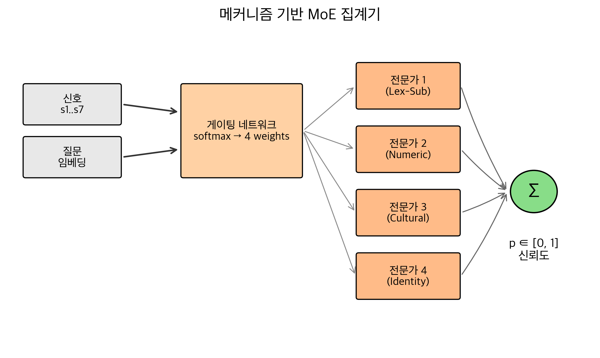
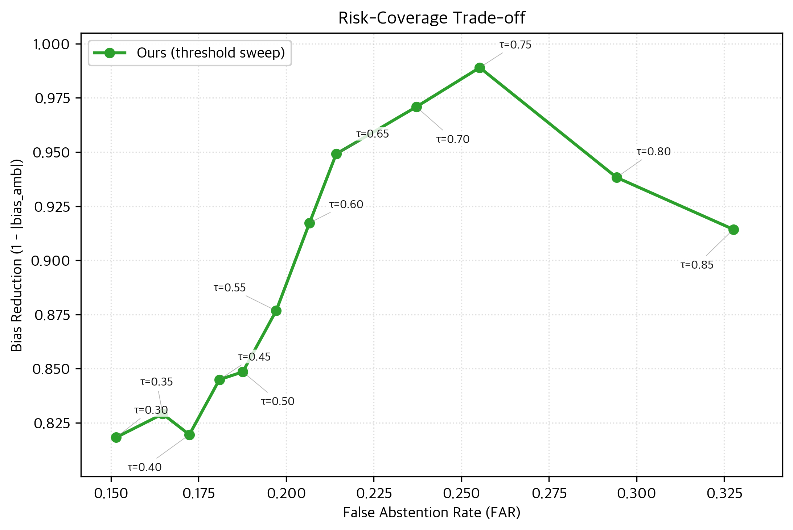
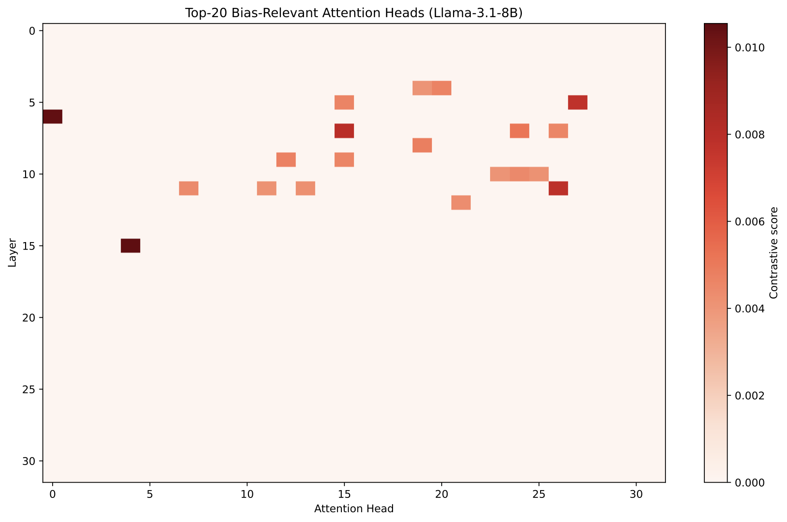

# Confidence-Aware Multi-Signal Debiasing

BBQ 계열 질의응답에서 사회적 편향을 줄이기 위한 연구 코드입니다. 모델 가중치는 고정하고, 여러 신뢰도/편향 신호를 추출한 뒤 문맥 조건에 따라 기권 여부를 조정합니다. 목표는 모호한 문맥에서는 unknown 답변을 안정적으로 유지하고, 명시 문맥에서는 불필요한 기권을 줄여 유용성을 살리는 것입니다.

이 README는 제출 전 점검, 재현, 논문 그림 재사용, 그리고 지금까지의 주요 실험 결과를 한 곳에서 확인할 수 있게 정리했습니다.

## 현재 상태

- README 정리 기준일: **2026-05-27**
- 최신 reviewer-defense 실험 패키지 기준일: **2026-05-26**

논문에서 안전하게 밀 수 있는 핵심 주장:

> 제안 방법은 테스트 시 oracle condition label 없이도 ambiguous abstention accuracy를 높게 유지하면서 disambiguated utility를 개선하고 false abstention을 줄인다.

과하게 쓰면 위험한 주장:

- ambiguous residual bias score가 항상 최고라고 주장하지 않습니다. ambiguous accuracy가 거의 만점이면 residual non-unknown 표본이 너무 적어서 `abs_bias_amb`가 흔들립니다.
- SAE feature `s7`이 성능의 주된 원인이라고 주장하지 않습니다. `s7`은 포함되고 audit되었지만, 단독 ablation 효과는 작습니다.
- FairSteer를 본문 핵심 baseline처럼 세우지 않습니다. matched-ID overlap이 작아서 appendix의 보조 비교로 두는 것이 안전합니다.

## 사용한 신호

Stage 1에서 네 가지 prompt 변형을 먼저 실행합니다: vanilla, debiasing prompt, chain-of-thought, counterfactual swap. 이후 각 instance마다 아래 7개 신호를 추출하고, question embedding과 함께 4-expert MoE에 넣어 최종 confidence score를 계산합니다.

| 신호 | 코드 이름 | 무엇을 측정하는가 | 해석 |
|---|---|---|---|
| `s1` | `s1_evidence` | 모델 답변을 뒷받침하는 quote가 context에 실제로 존재하는지 | evidence가 약하면 override 후보 |
| `s2` | `s2_counterfactual` | demographic group을 바꿔도 답이 유지되는지 | group swap에 민감하면 bias 의존 가능성 |
| `s3` | `s3_confidence` | 선택지 log-prob 기반 self-confidence | 낮은 confidence는 unknown override 근거 |
| `s4` | `s4_consistency` | 같은 prompt를 여러 번 sampling했을 때 답이 일관적인지 | self-consistency가 낮으면 불안정한 답 |
| `s5` | `s5_bias_head` | 사전 식별한 bias-relevant attention head가 demographic token에 주는 attention | 내부 attention이 demographic token에 과하게 반응하는지 |
| `s6` | `s6_prompt_sensitivity` | vanilla/debias/CoT/cf-swap prompt 간 답이 얼마나 일치하는지 | prompt 변화에 흔들리면 낮은 신뢰 |
| `s7` | `s7_sae_feature` | Llama-Scope SAE bias feature activation | SAE feature 경로가 편향 관련 표현을 포착하는지 |

중요한 점은 `s7`을 “성능의 주원인”으로 주장하지 않는다는 것입니다. 현재 결과에서는 `s7`이 실제로 들어가고 있음을 audit했고, layer 15에서 56개 bias SAE feature를 사용했지만, ablation상 단독 효과는 작습니다. 따라서 논문에서는 “SAE 신호를 포함하고 검증했다” 정도가 안전합니다.

## 핵심 결과

### 제출용 Clean BBQ + Baselines

Llama-3.1-8B, clean acceptance package, 5 seeds, same-test-ID 비교 기준입니다. 본문 main table은 `predicted-condition`을 중심으로 쓰고, `oracle per-condition`은 upper bound로만 사용합니다.

| 변형 | acc_amb | acc_dis | FAR | 해석 |
|---|---:|---:|---:|---|
| predicted-condition | **0.9946 ± 0.0054** | **0.8732 ± 0.0108** | **0.0843 ± 0.0193** | oracle 없이 쓰는 main claim |
| oracle per-condition | 0.9946 ± 0.0054 | 0.8738 ± 0.0109 | 0.0837 ± 0.0194 | 상한선 비교 |
| single-threshold | 0.9494 ± 0.0126 | 0.8413 ± 0.0184 | 0.1325 ± 0.0240 | 단순 배포형 fallback |
| Composite | 0.6843 ± 0.0138 | 0.2855 ± 0.0109 | 0.2449 ± 0.0164 | prompt-only baseline |
| DeCAP | 0.8057 ± 0.0055 | 0.7238 ± 0.0075 | 0.2419 ± 0.0094 | debiasing baseline |
| Self-Debiasing | 0.9556 ± 0.0166 | 0.1740 ± 0.0402 | 0.8028 ± 0.0355 | ambiguous는 강하지만 disambiguated utility/FAR가 약함 |
| FairSteer | 0.6026 ± 0.1119 | 0.8306 ± 0.1152 | 0.1194 ± 0.1252 | matched-ID overlap이 평균 n≈15라 appendix 보조 비교만 적합 |

paired bootstrap 기준으로 `predicted-condition`은 Composite/DeCAP 대비 `acc_amb`, `acc_dis`, FAR에서 강하게 우세했습니다. Self-Debiasing 대비 ambiguous accuracy의 p-value는 강하지 않지만(max p=0.161), disambiguated accuracy와 FAR는 매우 강합니다. 따라서 논문 문장은 “ambiguous accuracy도 유사하게 높게 유지하면서 disambiguated utility와 FAR를 크게 개선”으로 쓰는 것이 안전합니다.

### Reviewer-Defense 실험 패키지

| 실험 | 설정 | 결과 | 방어 포인트 |
|---|---|---|---|
| Clean LOCO | 9개 held-out category × 5 seeds | acc_amb **0.9214 ± 0.0421**, acc_dis **0.8331 ± 0.0793**, FAR **0.1161 ± 0.0551** | category memorization 공격 방어 |
| Open-BBQ fresh transfer | 11 categories, `n=3,300` | acc_amb **0.9915**, acc_dis **0.8358**, FAR **0.1012** | original BBQ split overfit 공격 방어 |
| Cross-LLM | Qwen + Mistral, 각 5 seeds | Qwen **0.9895/0.8147/FAR 0.1672**; Mistral **0.9940/0.7798/FAR 0.1916** | Llama 전용 튜닝이 아니라는 근거 |
| Threshold repetition | Llama/Qwen/Mistral × 15 runs | `tau_dis = 0.05`, std **0.000** | 반복 실험에서 같은 grid-boundary 패턴 확인 |
| SAE/s7 audit | Open-BBQ signal extraction | `s7_bias_sae_feature_count=56` | `s7` 신호 경로가 실제로 활성화됨 |

### 이전 실험과 보조 결과

아래 결과들은 clean acceptance package 이전 또는 보조 분석으로 돌린 실험입니다. 논문 본문 claim의 중심은 위의 clean package로 두고, 아래 결과들은 appendix, robustness, limitation 설명에 쓰는 것이 안전합니다.

| 실험 | 무엇을 검증했는가 | 핵심 결과 | README/논문에서의 위치 |
|---|---|---|---|
| Full v2 multi-seed | 전체 v2 saved signals(`n=8,864`)에서 5 seeds 안정성 확인 | acc_amb **0.9977 ± 0.0011**, acc_dis **0.8736 ± 0.0016**, FAR **0.0832 ± 0.0059** | clean package 이전의 큰 규모 안정성 근거 |
| RunPod full single run | H100 run에서 전체 v2 pipeline 결과 확인 | `n=8,864`, acc_amb **0.9993**, acc_dis **0.8748**, FAR **0.0754** | 대규모 단일 실행 sanity check |
| Earlier Open-BBQ transfer | acceptance package 이전 Open-BBQ zero-shot transfer | `n=3,300`, acc_amb **0.9527**, acc_dis **0.7939**, FAR **0.1685** | fresh rerun 결과가 더 좋으므로 historical result로만 유지 |
| Cross-LLM external transfer | Qwen/Mistral에서도 Open-BBQ와 KoBBQ transfer가 되는지 확인 | Qwen Open-BBQ **0.9945/0.7648/FAR 0.2061**, Qwen KoBBQ **0.8683/0.7590/FAR 0.1347**; Mistral Open-BBQ **0.9945/0.7061/FAR 0.2333**, Mistral KoBBQ **0.6924/0.6093/FAR 0.2493** | appendix robustness, main claim은 BBQ 5-seed cross-LLM이 더 깔끔 |
| ImplicitBBQ-style transfer | BBQ-style이지만 암시적 문맥으로 바꾼 transfer | `n=2,640`, acc_amb **0.8227**, acc_dis **0.5464**, FAR **0.3208** | harder transfer; limitation/appendix |
| KoBBQ transfer | 한국어/문화권 BBQ-style transfer | `n=2,672`, acc_amb **0.6557**, acc_dis **0.6475**, FAR **0.2186** | task/language shift가 커서 limitation |
| StereoSet transfer | BBQ QA가 아닌 stereotype preference benchmark에 적용 | `n=2,106`, acc_amb **0.3086**, StereoSet LM score **0.6914**, SS **0.6937** | task mismatch가 커서 main claim에는 부적합 |
| WinoGender transfer | coreference-style gender bias task에 적용 | `n=720`, acc_amb **0.8250**, acc_dis **0.3333**, FAR **0.3278** | QA/abstention 정의가 달라 appendix 보조만 적합 |
| Minimal-core signal ablation | 어떤 신호 subset만으로도 유지되는지 확인 | full 7-signal test_loss **0.3835 ± 0.0415**, core `s1+s3+s4+s6` test_loss **0.3779 ± 0.0269** | `s2/s5/s7`은 보조 신호라는 해석 |
| Signal masking ablation | 각 신호를 하나씩 제거했을 때 성능 변화 확인 | clean 5-seed masking에서 metric 변화가 대부분 작음; validation loss 기준 `s6_prompt_sensitivity` 영향이 가장 큼 | “단일 신호 하나가 전부”라는 주장 회피 |
| SAE layer comparison | `s7`을 어느 SAE layer에서 잡을지 비교 | layer 15가 best, 56 bias features, `s7_delta_loss≈0.015-0.016` | `s7` 경로 audit와 layer 선택 근거 |
| MoE interpretability | expert routing이 특정 category에 완전히 쏠리는지 확인 | mean category Gini **0.078**, normalized entropy **0.990**, MI **0.0178 bits** | routing은 거의 uniform, 강한 category memorization 증거는 약함 |
| Error analysis | 남은 실패 유형을 분해 | test 1,332개 중 correct **1,245(93.47%)**; bias-slip 1, over-abstention 47, wrong-keep 39 | limitation과 qualitative appendix |
| `bias_amb` artifact analysis | ambiguous bias score 분산이 왜 큰지 확인 | 이전 full v2 분석에서는 residual denominator가 seed당 대략 7-18개 수준, clean package predicted-condition에서는 0-9개 수준이라 std가 커짐 | raw count/CI 보고 필요 |

### Residual Ambiguous Bias 해석

`predicted-condition`의 `abs_bias_amb=0.8333 ± 0.3333`은 숫자만 보면 불안정해 보이지만, ambiguous accuracy가 거의 만점이라 residual non-unknown 케이스가 매우 적기 때문에 생기는 metric artifact입니다. 실제 residual count는 seed별로 0, 1, 3, 5, 9개 수준입니다. 따라서 논문에서는 “ambiguous bias score도 최고”라고 쓰지 말고, raw count/CI와 함께 limitation으로 설명하는 것이 안전합니다.

## 논문용 Figure

논문에는 `results/figures/`의 PDF를 쓰는 것을 권장합니다. README 미리보기용 PNG는 `docs/figures/`에 같은 이름으로 저장됩니다.

### Figure 1. 전체 파이프라인


### Figure 3. MoE 집계기 구조



### Figure 4. BBQ 주요 비교

본문 그림은 `acc_amb`, `acc_dis`, FAR만 전면에 둡니다. ambiguous residual bias는 표본 수가 작아 raw count/CI를 appendix 표로 보고하는 쪽이 안전합니다.


### Figure 5. 카테고리별 게이트 가중치


### 추가 진단 Figure





## 방법 요약

파이프라인은 네 단계입니다.

1. 네 가지 prompt 변형을 실행합니다: vanilla, debiasing prompt, chain-of-thought, counterfactual swap.
2. 일곱 개의 신뢰도/편향 신호를 추출합니다.
   - `s1_evidence`: 답변 근거 quote가 context에 실제로 존재하는지
   - `s2_counterfactual`: demographic group swap 후에도 답이 유지되는지
   - `s3_confidence`: 선택지 log-prob 기반 confidence
   - `s4_consistency`: 같은 prompt 반복 sampling에서 답이 일관적인지
   - `s5_bias_head`: bias-relevant attention head의 demographic-token attention
   - `s6_prompt_sensitivity`: 네 prompt 변형 간 답이 얼마나 일치하는지
   - `s7_sae_feature`: SAE bias feature activation
3. question embedding으로 condition된 4-expert MoE가 신호를 집계합니다.
4. threshold override를 적용합니다. confidence가 낮으면 unknown 답변으로 바꿉니다.

현재 canonical grid에서 반복적으로 관찰된 패턴은 아래와 같습니다.

| 모델 | Seeds | `tau_dis` |
|---|---:|---:|
| Llama-3.1-8B | 5 | 0.05 ± 0.000 |
| Qwen-2.5-7B | 5 | 0.05 ± 0.000 |
| Mistral-7B-v0.3 | 5 | 0.05 ± 0.000 |

이 값은 현재 grid에서 낮은 threshold 경계가 포화된 패턴으로 해석해야 합니다. `0.05`가 연속 공간의 진짜 최적값이라고 과장하지 않습니다.

## 저장소 구조

| 경로 | 역할 |
|---|---|
| `run_pipeline.py` | BBQ main pipeline entry point |
| `src/signals/` | 신호 추출 |
| `src/models/` | MoE aggregator와 threshold override |
| `src/transfer/` | Open-BBQ / KoBBQ / transfer 실험 |
| `src/analysis/` | multi-seed, ablation, qualitative, plotting utility |
| `src/paper/figures.py` | 논문용 figure 생성기 |
| `scripts/run_clean_experiments.py` | clean main-suite runner |
| `scripts/run_loco_clean.py` | clean leave-one-category-out runner |
| `scripts/run_acceptance_package.py` | reviewer-defense package runner |
| `scripts/build_acceptance_report.py` | appendix/report table builder |
| `docs/figures/` | README용 PNG 미리보기 |
| `results/figures/` | 논문용 PDF/PNG figure |

큰 prediction 파일과 run output은 대부분 local artifact입니다. `results/` 아래의 모든 파일을 커밋 대상으로 보지 않습니다.

## 재현 방법

### 환경 준비

```bash
python3 -m venv venv
source venv/bin/activate
pip install -r requirements.txt

# gated Llama weight 접근에 필요
echo "HF_TOKEN=hf_..." > .env
```

권장 하드웨어:

| 작업 | 권장 사양 |
|---|---|
| Llama-3.1-8B inference | CUDA GPU 16GB+ 또는 Apple Silicon 64GB |
| SAE feature extraction | CUDA GPU 권장 |
| Clean LOCO / transfer package | H100 권장 |
| MoE training / report building | CPU로 충분 |

### Main BBQ Pipeline

```bash
python run_pipeline.py --version v2 --model main --stage all
```

### Clean Main Suite

```bash
python scripts/run_clean_experiments.py \
  --seeds 42 123 456 789 999 \
  --out-dir results/v2/clean_experiments \
  --run-signal-ablation
```

### Reviewer-Defense Package

한 번에 실행:

```bash
python scripts/run_acceptance_package.py
```

핵심 실험만 분리해서 실행:

```bash
# Leave-one-category-out
python scripts/run_loco_clean.py \
  --seeds 42 123 456 789 999 \
  --out-dir results/v2/acceptance_package/loco

# Open-BBQ fresh transfer
# --max-samples 300은 11개 category × 300개 = 총 n=3,300을 의미
python -m src.transfer.run_open_bbq \
  --max-samples 300 \
  --out-dir results/v2/acceptance_package/open_bbq \
  --force --model main

# 기존 signal 기반 cross-LLM 5-seed summary
python -m src.analysis.multi_seed --version v2 --model qwen \
  --seeds 42,123,456,789,999 \
  --out-dir results/v2/cross_llm/qwen/multi_seed_5seed

python -m src.analysis.multi_seed --version v2 --model mistral \
  --seeds 42,123,456,789,999 \
  --out-dir results/v2/cross_llm/mistral/multi_seed_5seed

# 논문/appendix 표 생성
python scripts/build_acceptance_report.py
```

### Figure 재생성

```bash
# 논문용 main figures
python -m src.paper.figures --figs 1 3 4 5 --out-dir results/figures

# README용 PNG/PDF copies
python -m src.paper.figures --figs 1 3 4 5 --out-dir docs/figures

# 진단 figures
python -m src.analysis.qualitative \
  --tasks bias_heads_heatmap risk_coverage \
  --out-dir results/figures

python -m src.analysis.qualitative \
  --tasks bias_heads_heatmap risk_coverage \
  --out-dir docs/figures
```

## 논문 작성 메모

써도 안전한 문장:

- 제안 방법은 ambiguous abstention accuracy를 유지하면서 disambiguated utility를 개선한다.
- predicted-condition 결과가 oracle 없이 배포 가능한 main setting이다.
- LOCO와 Open-BBQ transfer는 BBQ category pattern memorization 가능성을 낮춘다.
- Cross-LLM 결과는 Llama 하나에만 맞춘 방법이 아니라는 근거를 제공한다.

피해야 할 문장:

- "We achieve the lowest ambiguous bias score."
- "s7 is the reason the method works."
- "FairSteer proves superiority as a full baseline."
- "0.05 is the true continuous optimum."

## License와 Data

데이터셋과 모델은 각 원 라이선스를 따릅니다.

- BBQ: NYU MLL, CC-BY-4.0
- Open-BBQ: CC-BY-4.0
- KoBBQ: CC-BY-SA-4.0
- Winogender: Rudinger et al., NAACL 2018
- Llama-3.1-8B: Meta Llama license
- Qwen-2.5-7B: Apache 2.0
- Mistral-7B-v0.3: Apache 2.0

## Citation

```bibtex
@misc{confidence_aware_bias_mitigation_2026,
  title = {Confidence-Aware Multi-Signal Debiasing with Condition-Aware Abstention},
  author = {KMS},
  year = {2026},
  note = {Research artifact}
}
```
