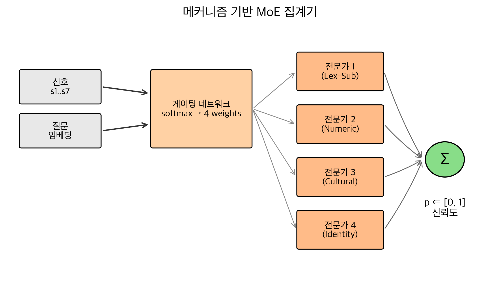
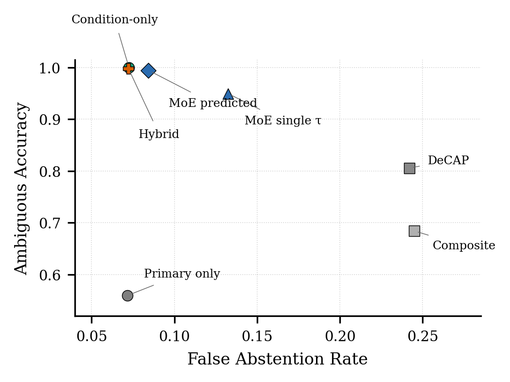
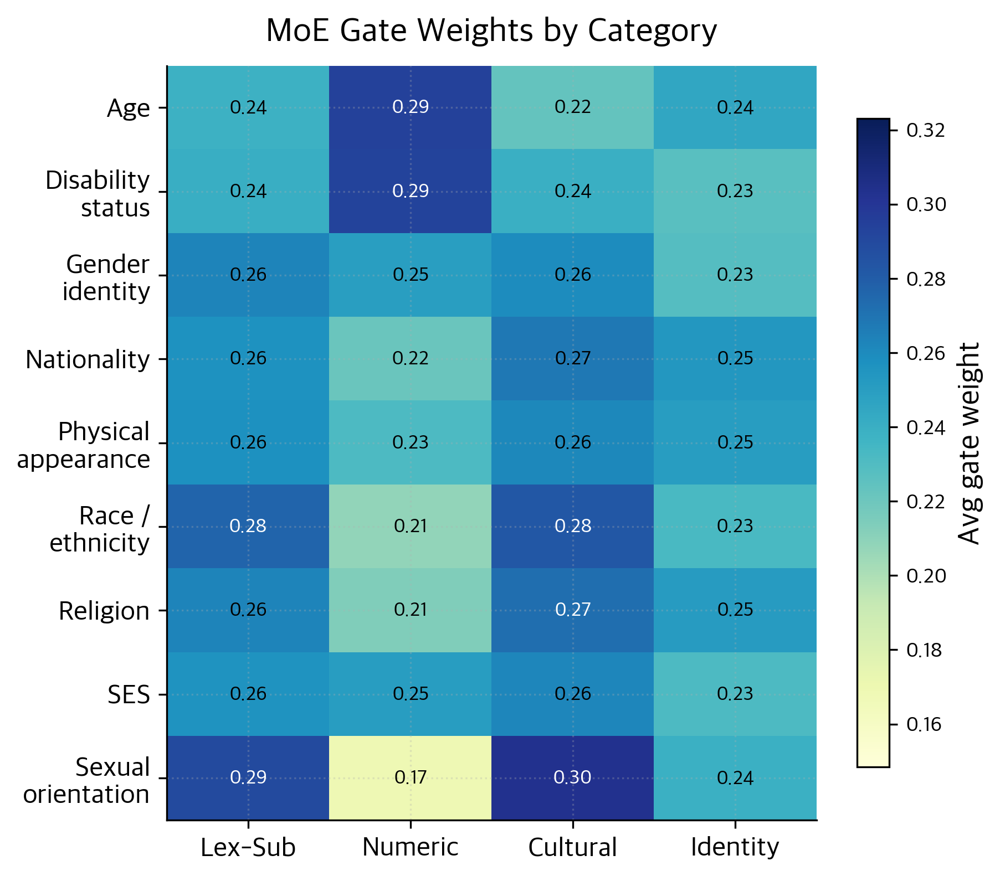
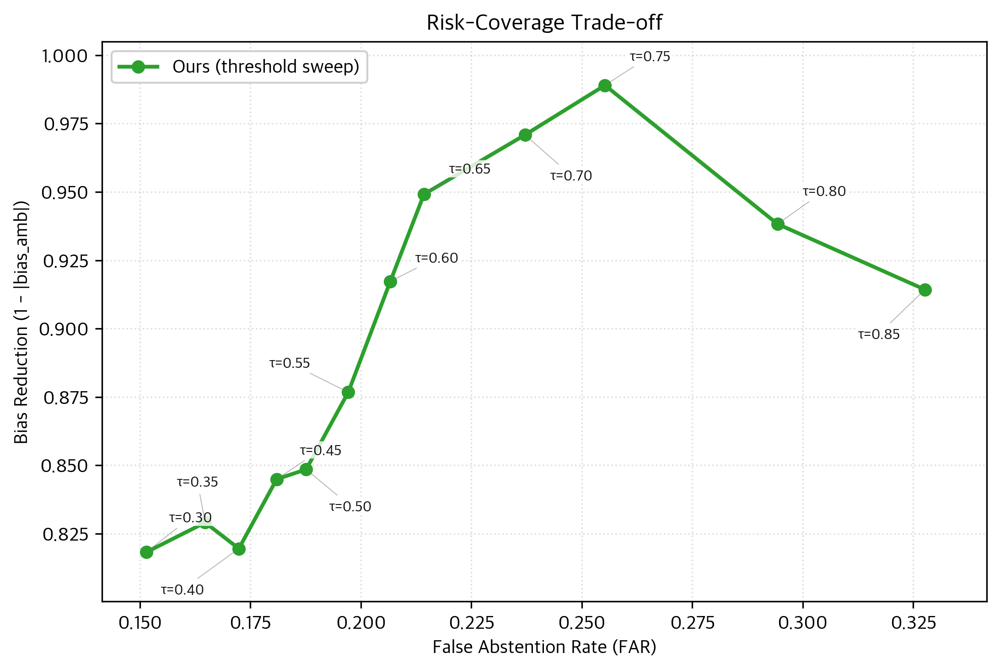
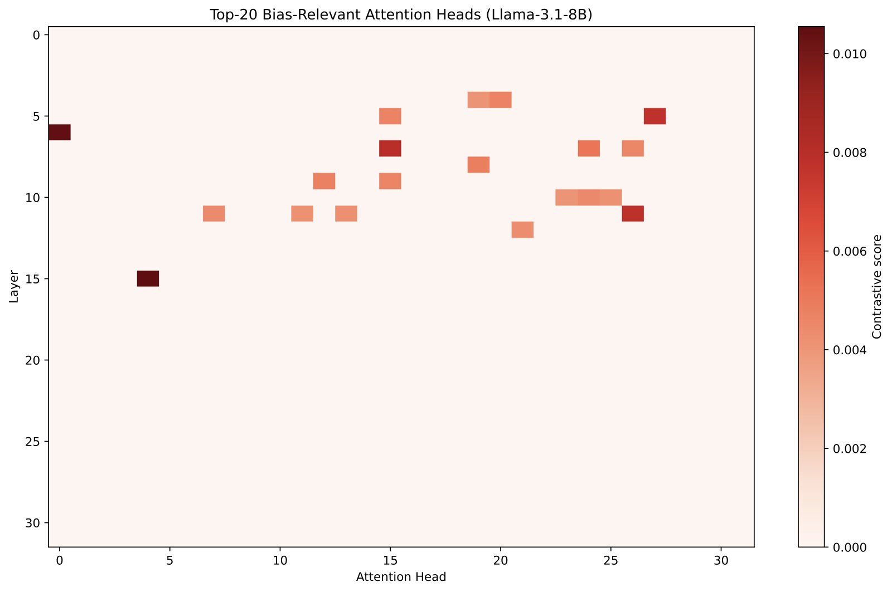

# Condition-Aware Selective Abstention for Bias Benchmark QA

BBQ 계열 질의응답에서 사회적 편향을 줄이기 위한 연구 코드입니다. 모델 가중치는 고정하고, 문맥이 ambiguous인지 disambiguated인지 예측한 뒤 condition-aware abstention을 적용합니다. 목표는 모호한 문맥에서는 unknown 답변을 안정적으로 유지하고, 명시 문맥에서는 불필요한 기권을 줄여 유용성을 보존하는 것입니다.

이 README는 제출 전 점검, 재현, 논문 그림 재사용, 그리고 지금까지의 주요 실험 결과를 한 곳에서 확인할 수 있게 정리했습니다.

## 현재 상태

- README 정리 기준일: **2026-05-28**
- 최신 clean / hybrid audit 패키지 기준일: **2026-05-28**

논문에서 안전하게 밀 수 있는 핵심 주장:

> 제안 방법은 테스트 시 oracle condition label 없이도 ambiguous 문맥의 unsupported answer를 unknown으로 바꾸면서 disambiguated utility를 거의 손상하지 않는다.

2026-05-28 기준으로 더 안전한 framing은 다음입니다.

> Clean BBQ에서는 condition-aware selective abstention 자체가 거의 ceiling이며, 7개 신호/MoE는 clean split의 주된 성능 원인이라기보다 low-label 또는 condition-uncertain 상황에서 fallback으로 유용하다. 또한 rule-based explanation layer를 통해 어떤 답이 stereotype/anti-stereotype/unknown으로 처리됐는지 감사 가능하게 만든다.

과하게 쓰면 위험한 주장:

- ambiguous residual bias score가 항상 최고라고 주장하지 않습니다. ambiguous accuracy가 거의 만점이면 residual non-unknown 표본이 너무 적어서 `abs_bias_amb`가 흔들립니다.
- SAE feature `s7`이 성능의 주된 원인이라고 주장하지 않습니다. `s7`은 포함되고 audit되었지만, 단독 ablation 효과는 작습니다.
- 7-signal MoE가 clean BBQ에서 condition-only보다 우월하다고 주장하지 않습니다. clean split에서는 condition-only가 더 단순하고 더 강합니다.
- FairSteer를 본문 핵심 baseline처럼 세우지 않습니다. matched-ID overlap이 작아서 appendix의 보조 비교로 두는 것이 안전합니다.

## 사용한 신호

Stage 1에서 네 가지 prompt 변형을 먼저 실행합니다: vanilla, debiasing prompt, chain-of-thought, counterfactual swap. 이후 각 instance마다 아래 7개 신호를 추출합니다. 최종 논문 framing에서는 condition-only abstention이 clean split의 주된 결과이고, 7개 신호/MoE는 low-label 또는 uncertain condition prediction 상황의 fallback 및 audit layer로 둡니다.

| 신호 | 코드 이름 | 무엇을 측정하는가 | 해석 |
|---|---|---|---|
| `s1` | `s1_evidence` | 모델 답변을 뒷받침하는 quote가 context에 실제로 존재하는지 | evidence가 약하면 override 후보 |
| `s2` | `s2_counterfactual` | demographic group을 바꿔도 답이 유지되는지 | group swap에 민감하면 bias 의존 가능성 |
| `s3` | `s3_confidence` | 선택지 log-prob 기반 self-confidence | 낮은 confidence는 unknown override 근거 |
| `s4` | `s4_consistency` | 같은 prompt를 여러 번 sampling했을 때 답이 일관적인지 | self-consistency가 낮으면 불안정한 답 |
| `s5` | `s5_bias_head` | 사전 식별한 bias-relevant attention head가 demographic token에 주는 attention | 내부 attention이 demographic token에 과하게 반응하는지 |
| `s6` | `s6_prompt_sensitivity` | vanilla/debias/CoT/cf-swap prompt 간 답이 얼마나 일치하는지 | prompt 변화에 흔들리면 낮은 신뢰 |
| `s7` | `s7_sae_feature` | Llama-Scope SAE bias feature activation | SAE feature 경로가 편향 관련 표현을 포착하는지 |

중요한 점은 `s7`을 “성능의 주원인”으로 주장하지 않는다는 것입니다. 현재 결과에서는 `s7`이 실제로 들어가고 있음을 audit했고, layer 15에서 56개 bias SAE feature를 사용했지만, ablation상 단독 효과는 작습니다. 따라서 논문에서는 “SAE 신호를 포함하고 검증했다” 정도가 안전합니다.

## 핵심 결과

### 제출용 Clean BBQ + Baselines

Llama-3.1-8B, clean five-seed package, same-test-ID 비교 기준입니다. 본문 main table은 `predicted-condition`과 `condition-only retention`을 중심으로 쓰고, `oracle per-condition`은 upper bound로만 사용합니다.

| 변형 | acc_amb | acc_dis | FAR | 해석 |
|---|---:|---:|---:|---|
| condition-only (corrected full features) | **0.9994 ± 0.0008** | **0.8786 ± 0.0076** | **0.0729 ± 0.0070** | corrected clean split의 가장 강한 main row |
| hybrid uncertain-signal fallback (original diagnostic) | 0.9979 ± 0.0020 | 0.8795 ± 0.0070 | 0.0723 ± 0.0071 | corrected row와 직접 비교하지 않는 보조 audit |
| predicted-condition MoE (corrected) | 0.9937 ± 0.0073 | 0.8753 ± 0.0098 | 0.0822 ± 0.0157 | oracle 없이 쓰는 corrected MoE row |
| oracle per-condition MoE (corrected) | 0.9952 ± 0.0062 | 0.8756 ± 0.0097 | 0.0819 ± 0.0155 | 근사 상한선 비교 |
| single-threshold MoE (corrected) | 0.9500 ± 0.0125 | 0.8416 ± 0.0047 | 0.1325 ± 0.0074 | condition split 제거 |
| Composite-style (simplified) | 0.7181 ± 0.0234 | 0.2858 ± 0.0120 | 0.2461 ± 0.0167 | Open-BBQ 공식 protocol이 아닌 zero-shot fairness+CoT 구현 |
| DeCAP-inspired (simplified) | 0.8057 ± 0.0055 | 0.7238 ± 0.0075 | 0.2419 ± 0.0094 | 공식 DeCAP의 ambiguity detector를 생략한 구현 |
| self-debiasing-style reprompting | 0.9584 ± 0.0078 | 0.1928 ± 0.0111 | 0.7858 ± 0.0083 | 공식 재현이 아니라 reprompting baseline; auxiliary replication note |
| FairSteer (corrected run) | 0.8513 ± 0.0069 | 0.7185 ± 0.0131 | 0.2591 ± 0.0129 | in-pool steering-vector 적합 때문에 appendix 보조 비교만 적합 |

`primary answer only`는 acc_dis 0.8798, FAR 0.0717로 이미 disambiguated에서는 강합니다. 따라서 clean split의 핵심 기여는 “disambiguated를 더 잘 맞힌다”가 아니라 “disambiguated utility를 거의 보존하면서 ambiguous에서 unsupported raw answer를 unknown으로 바꾼다”입니다. Paired bootstrap 비교는 원래 diagnostic MoE와 공개한 **단순화된** Composite-style/DeCAP-inspired 구현 사이의 비교이며, 공식 논문 protocol 전체에 대한 우월성 주장이 아닙니다. Self-debiasing-style reprompting 대비 ambiguous accuracy의 p-value는 강하지 않지만(max p=0.161), disambiguated accuracy와 FAR는 매우 강합니다.

### Hybrid fallback / explanation audit

단순 condition-only가 clean BBQ에서는 너무 강하기 때문에, 7-signal MoE를 “항상 더 좋은 메인 방법”으로 밀면 위험합니다. 대신 condition classifier supervision이 부족하거나 confidence가 낮은 경우의 fallback으로 쓰는 것이 더 방어 가능합니다. Hybrid에서 uncertainty는 condition classifier의 `predict_proba` 중 큰 값, 즉 ambiguous/disambiguated 확률의 max confidence로 정의하고, confidence threshold와 MoE risk threshold는 validation에서만 고릅니다.

| 조건 | system | acc_amb | acc_dis | FAR | 해석 |
|---|---|---:|---:|---:|---|
| condition label 1% | condition-only | 0.9136 ± 0.0051 | 0.6786 ± 0.0674 | 0.2931 ± 0.0680 | classifier가 약하면 utility/FAR가 무너짐 |
| condition label 1% | hybrid fallback | **0.9530 ± 0.0054** | **0.8247 ± 0.0313** | **0.1452 ± 0.0339** | 신호 fallback이 가장 크게 도움 |
| condition label 5% | condition-only | 0.9645 ± 0.0097 | 0.8301 ± 0.0096 | 0.1280 ± 0.0114 | 저라벨 조건 |
| condition label 5% | hybrid fallback | **0.9744 ± 0.0110** | **0.8548 ± 0.0071** | **0.1048 ± 0.0079** | 여전히 이득 있음 |

1% label 조건에서는 평균뿐 아니라 안정성도 좋아졌습니다. acc_dis 표준편차가 condition-only 0.0674에서 hybrid 0.0313으로 줄어듭니다. 다만 이 비율은 **condition classifier의 training label만** 줄인 것입니다. 고정 MoE는 6,208개 train item의 gold answer target, ambiguous-condition mask, stereotype metadata로 학습됐고, threshold 선택에는 1,328개 전체 labeled validation set을 썼습니다. 따라서 “총 annotation budget 1%”나 “62개 label로 end-to-end 학습”으로 해석하면 안 됩니다. 10%와 100% label로 가면 차이가 작아지므로, 논문에서는 multi-signal layer를 이 제한된 low-training-label condition-classifier audit의 fallback으로만 해석합니다.

Rule-based explanation artifact도 추가했습니다. `ours_predicted_condition` 5 seeds, 총 6,640개 seed-level decisions 기준:

| decision label | count | share |
|---|---:|---:|
| utility-preserving keep | 2,899 | 0.4366 |
| ambiguous abstention | 1,858 | 0.2798 |
| stereotyped raw answer blocked | 1,035 | 0.1559 |
| anti-stereotyped unsupported answer blocked | 409 | 0.0616 |
| false abstention | 280 | 0.0422 |
| stereotype bias slip | 10 | 0.0015 |

이 설명 레이어는 free-form LLM rationale이 아니라 deterministic rule입니다. Runtime 설명은 predicted condition과 signal flags만 쓰고, 논문용 audit label은 평가 후 BBQ gold metadata로 분류합니다. 따라서 배포 시 정답 라벨을 쓰는 구조가 아닙니다.

### Robustness / Audit 실험 패키지

| 실험 | 설정 | 결과 | 방어 포인트 |
|---|---|---|---|
| Clean LOCO | 9개 held-out category × 5 seeds | acc_amb **0.9214 ± 0.0421**, acc_dis **0.8331 ± 0.0793**, FAR **0.1161 ± 0.0551** | category memorization 공격 방어 |
| Open-BBQ related-dataset replay | 11 categories, `n=3,300`; raw context+question exact overlap with the 8,864-item source pool: `1,276` (38.7%) | full-set published-checkpoint predicted-condition MoE **0.9897/0.8327/FAR 0.1048**; condition-only **0.9915/0.8309/FAR 0.1030**. On the `n=2,024` non-overlap subset: MoE **0.9841/0.8616/FAR 0.0775**; condition-only **0.9861/0.8567/FAR 0.0805** | independent external test가 아니라 partially overlapping compatibility audit; 중복 제거 후에도 정성 결론은 유지 |
| Cross-LLM retention-layer audit | Qwen + Mistral, 각 5 seeds, backbone별 MoE 독립 학습/validation 튜닝, gold-condition routing, validation-best checkpoint | Qwen **0.9943/0.8177/FAR 0.1639**; Mistral **0.9946/0.7823/FAR 0.1847** | no-oracle transfer가 아니라 backbone별 retention layer가 정성적 패턴을 재현하는지 보는 제한된 audit |
| KoBBQ condition-transfer audit | 중복 ID 제거 후 English BBQ에서 train하여 KoBBQ test, KoBBQ row split, companion-disjoint split | English→KoBBQ embedding-only **0.5000**, signals-only **0.6536**; within-KoBBQ row split embedding-only **0.9989**; companion-disjoint **1.0000** | KoBBQ 자체는 separable하지만 영어 MiniLM representation transfer가 깨진다는 limitation; companion leakage를 제거해도 within-KoBBQ 결론 유지 |
| Threshold repetition | Llama/Qwen/Mistral × 15 runs | `tau_dis = 0.05`, std **0.000** | 반복 실험에서 같은 grid-boundary 패턴 확인 |
| SAE/s7 audit | Open-BBQ signal extraction | `s7_bias_sae_feature_count=56` | `s7` 신호 경로가 실제로 활성화됨 |

### 이전 실험과 보조 결과

아래 결과들은 final clean package 이전 또는 보조 분석으로 돌린 실험입니다. 논문 본문 claim의 중심은 위의 clean package로 두고, 아래 결과들은 appendix, robustness, limitation 설명에 쓰는 것이 안전합니다.

| 실험 | 무엇을 검증했는가 | 핵심 결과 | README/논문에서의 위치 |
|---|---|---|---|
| Legacy full-pool multi-seed diagnostic | 80/20 train/validation 뒤 전체 v2 saved-signal pool(`n=8,864`)을 다시 평가 | acc_amb **0.9977 ± 0.0011**, acc_dis **0.8736 ± 0.0016**, FAR **0.0832 ± 0.0059** | held-out test 또는 안정성 근거가 아님; protocol provenance로만 유지 |
| Full single run | 전체 v2 pipeline 결과 확인 | `n=8,864`, acc_amb **0.9993**, acc_dis **0.8748**, FAR **0.0754** | 대규모 단일 실행 sanity check |
| Earlier Open-BBQ transfer | final clean protocol 이전 Open-BBQ zero-shot transfer | `n=3,300`, acc_amb **0.9527**, acc_dis **0.7939**, FAR **0.1685** | protocol sensitivity로만 유지 |
| Cross-LLM external transfer (raw runner) | Qwen/Mistral 저장 신호를 Open-BBQ와 KoBBQ에 적용 | Qwen Open-BBQ **0.9945/0.7648/FAR 0.2061**, Qwen KoBBQ raw `n=2672` **0.8683/0.7590/FAR 0.1347**; Mistral Open-BBQ **0.9945/0.7061/FAR 0.2333**, Mistral KoBBQ raw `n=2672` **0.6924/0.6093/FAR 0.2493** | raw runner는 target gold condition으로 threshold를 고르는 oracle-routed diagnostic이며, 검증 가능한 저장 artifact 값만 기재 |
| ImplicitBBQ-style stress | BBQ 문맥의 명시적 단서를 암시적으로 바꾼 저자 생성 stress set | `n=2,640`, acc_amb **0.8227**, acc_dis **0.5464**, FAR **0.3208** | legacy scalar-threshold artifact; full source/embeddings unavailable; appendix only |
| KoBBQ transfer | 한국어/문화권 BBQ-style transfer, archived first-occurrence dedup | `n=2,576`, acc_amb **0.6491**, acc_dis **0.6522**, FAR **0.2127** | 새 LLM 호출 없는 archive rerouting; end-to-end transfer는 약함 |
| StereoSet transfer | BBQ QA가 아닌 stereotype preference benchmark에 적용 | `n=2,106`, acc_amb **0.3086**, StereoSet LM score **0.6914**, SS **0.6937** | task mismatch가 커서 main claim에는 부적합 |
| WinoGender transfer | coreference-style gender bias task에 적용 | `n=720`, acc_amb **0.8250**, acc_dis **0.3333**, FAR **0.3278** | QA/abstention 정의가 달라 appendix 보조만 적합 |
| Minimal-core signal ablation | 어떤 신호 subset만으로도 유지되는지 확인 | full 7-signal test_loss **0.3835 ± 0.0415**, core `s1+s3+s4+s6` test_loss **0.3779 ± 0.0269** | `s2/s5/s7`은 보조 신호라는 해석 |
| Signal masking ablation | 각 신호를 하나씩 제거했을 때 성능 변화 확인 | clean 5-seed masking에서 metric 변화가 대부분 작음; validation loss 기준 `s6_prompt_sensitivity` 영향이 가장 큼 | “단일 신호 하나가 전부”라는 주장 회피 |
| SAE layer comparison | `s7`을 어느 SAE layer에서 잡을지 비교 | layer 15가 best, 56 bias features, `s7_delta_loss≈0.015-0.016` | `s7` 경로 audit와 layer 선택 근거 |
| MoE interpretability | expert routing이 특정 category에 완전히 쏠리는지 확인 | published-checkpoint Open-BBQ: mean category Gini **0.0777**, normalized entropy **0.9900**, MI **0.0178 bits**, NMI **0.0089** | routing은 거의 uniform, 강한 category memorization 증거는 약함 |
| Error analysis | 남은 실패 유형을 분해 | test 1,332개 중 correct **1,245(93.47%)**; bias-slip 1, false abstention 47, wrong-keep 39 | limitation과 qualitative appendix |
| `bias_amb` artifact analysis | ambiguous bias score 분산이 왜 큰지 확인 | 이전 full v2 분석에서는 residual denominator가 seed당 대략 7-18개 수준, clean package predicted-condition에서는 0-9개 수준이라 std가 커짐 | raw count/CI 보고 필요 |

### Residual Ambiguous Bias 해석

`predicted-condition`의 `abs_bias_amb=0.8333 ± 0.3333`은 숫자만 보면 불안정해 보이지만, ambiguous accuracy가 거의 만점이라 residual non-unknown 케이스가 매우 적기 때문에 생기는 metric artifact입니다. 실제 residual count는 seed별로 0, 1, 3, 5, 9개 수준입니다. 따라서 논문에서는 “ambiguous bias score도 최고”라고 쓰지 말고, raw count/CI와 함께 limitation으로 설명하는 것이 안전합니다.

## 논문용 Figure

논문에는 `paper/ieee_access/figures/`의 PDF를 사용합니다. README 미리보기용 PNG는 `docs/figures/`에 같은 이름으로 저장됩니다. 현재 `access.tex`의 Fig. 1과 Fig. 2는 Overleaf 호환성을 위해 LaTeX picture로 직접 그립니다.

### Figure 1. 전체 파이프라인


### Figure 3. MoE 집계기 구조



### Figure 4. 운영 지점 trade-off

본문에서는 clean split의 핵심 비교를 Pareto-style trade-off로 보여줍니다. Self-debiasing-style reprompting은 FAR가 0.7858로 너무 크고 MPT는 단일 fixed-split 값이어서, 둘 다 본문 plot에서는 제외하고 표/appendix에서 다룹니다.



### Figure 5. 카테고리별 게이트 가중치



### 추가 진단 Figure: older qualitative audits





## 방법 요약

파이프라인은 네 단계입니다.

1. 네 가지 prompt 변형을 실행합니다: vanilla, debiasing prompt, chain-of-thought, counterfactual swap.
2. 일곱 개의 신뢰도/편향 신호를 추출합니다.
   - `s1_evidence`: 답변 근거 quote가 context에 실제로 존재하는지
   - `s2_counterfactual`: demographic group swap 후에도 답이 유지되는지
   - `s3_confidence`: 선택지 log-prob 기반 confidence
   - `s4_consistency`: 같은 prompt 반복 sampling에서 답이 일관적인지
   - `s5_bias_head`: bias-relevant attention head의 demographic-token attention
   - `s6_prompt_sensitivity`: 네 prompt 변형 간 답이 얼마나 일치하는지
   - `s7_sae_feature`: SAE bias feature activation
3. condition classifier가 ambiguous/disambiguated를 예측합니다.
4. clean split의 기본 배포형은 condition-only rule입니다: ambiguous면 unknown, disambiguated면 primary answer를 유지합니다.
5. condition confidence가 낮은 경우에는 4-expert MoE가 7개 신호를 fallback으로 집계합니다.

현재 canonical grid에서 반복적으로 관찰된 패턴은 아래와 같습니다.

| 모델 | Seeds | `tau_dis` |
|---|---:|---:|
| Llama-3.1-8B | 5 | 0.05 ± 0.000 |
| Qwen-2.5-7B | 5 | 0.05 ± 0.000 |
| Mistral-7B-v0.3 | 5 | 0.05 ± 0.000 |

이 값은 현재 grid에서 낮은 threshold 경계가 포화된 패턴으로 해석해야 합니다. `0.05`가 연속 공간의 진짜 최적값이라고 과장하지 않습니다.

## 저장소 구조

| 경로 | 역할 |
|---|---|
| `run_pipeline.py` | BBQ main pipeline entry point |
| `src/signals/` | 신호 추출 |
| `src/models/` | MoE aggregator와 threshold override |
| `src/transfer/` | Open-BBQ / KoBBQ / transfer 실험 |
| `src/analysis/` | multi-seed, ablation, qualitative, plotting utility |
| `src/paper/figures.py` | 논문용 figure 생성기 |
| `scripts/run_clean_experiments.py` | clean main-suite runner |
| `scripts/run_loco_clean.py` | clean leave-one-category-out runner |
| `scripts/run_hybrid_abstention_audits.py` | low-label hybrid fallback audit |
| `scripts/run_transfer_condition_audits.py` | KoBBQ condition-transfer audit |
| `scripts/generate_rule_based_explanations.py` | deterministic explanation artifact |
| `scripts/generate_revision_figures.py` | paper revision용 Pareto/routing figure 생성 |
| `scripts/run_acceptance_package.py` | clean robustness package runner |
| `scripts/build_acceptance_report.py` | appendix/report table builder |
| `docs/figures/` | README용 PNG 미리보기 |
| `results/figures/` | 논문용 PDF/PNG figure |

큰 prediction 파일과 run output은 대부분 local artifact입니다. `results/` 아래의 모든 파일을 커밋 대상으로 보지 않습니다.

## 재현 방법

### 환경 준비

```bash
python3 -m venv venv
source venv/bin/activate
pip install -r requirements.txt

# gated Llama weight 접근에 필요
echo "HF_TOKEN=hf_..." > .env
```

권장 하드웨어:

| 작업 | 권장 사양 |
|---|---|
| Llama-3.1-8B inference | CUDA GPU 16GB+ 또는 Apple Silicon 64GB |
| SAE feature extraction | CUDA GPU 권장 |
| Clean LOCO / transfer package | H100 권장 |
| MoE training / report building | CPU로 충분 |

### Main BBQ Pipeline

```bash
python run_pipeline.py --version v2 --model main --stage all
```

### Clean Main Suite

```bash
python scripts/run_clean_experiments.py \
  --model corrected_full \
  --seeds 42 123 456 789 999 \
  --out-dir results/v2/clean_experiments_corrected_full
```

### Reviewer-Defense Package

한 번에 실행:

```bash
python scripts/run_acceptance_package.py
```

핵심 실험만 분리해서 실행:

```bash
# Leave-one-category-out
python scripts/run_loco_clean.py \
  --seeds 42 123 456 789 999 \
  --out-dir results/v2/acceptance_package/loco

# Open-BBQ raw feature transfer. This runner uses target gold condition for
# threshold routing; use run_transfer_routing_unify.py for the paper's
# predicted-condition reconstruction.
# --max-samples 300은 11개 category × 300개 = 총 n=3,300을 의미
python -m src.transfer.run_open_bbq \
  --max-samples 300 \
  --out-dir results/v2/acceptance_package/open_bbq \
  --force --model main

# 기존 signal 기반 cross-LLM 5-seed summary
python -m src.analysis.multi_seed --version v2 --model qwen \
  --seeds 42,123,456,789,999 \
  --out-dir results/v2/cross_llm/qwen/multi_seed_5seed

python -m src.analysis.multi_seed --version v2 --model mistral \
  --seeds 42,123,456,789,999 \
  --out-dir results/v2/cross_llm/mistral/multi_seed_5seed

# 논문/appendix 표 생성
python scripts/build_acceptance_report.py

# low-label hybrid fallback audit
python scripts/run_hybrid_abstention_audits.py

# KoBBQ condition-transfer audit
python scripts/run_transfer_condition_audits.py \
  --transfer-name kobbq \
  --transfer-dir results/v2_runpod/transfer/kobbq \
  --out-dir results/v2/reviewer_audits/kobbq_deduplicated_condition
```

### Figure 재생성

```bash
# 논문용 main figures
python -m src.paper.figures --figs 1 3 4 5 --out-dir results/figures

# README용 PNG/PDF copies
python -m src.paper.figures --figs 1 3 4 5 --out-dir docs/figures

# 진단 figures
python scripts/generate_revision_figures.py

python -m src.analysis.qualitative \
  --tasks bias_heads_heatmap risk_coverage \
  --out-dir results/figures

python -m src.analysis.qualitative \
  --tasks bias_heads_heatmap risk_coverage \
  --out-dir docs/figures
```

## 논문 작성 메모

써도 안전한 문장:

- 제안 방법은 ambiguous unsupported answers를 unknown으로 바꾸면서 disambiguated utility를 보존한다.
- predicted-condition 결과가 oracle 없이 배포 가능한 main setting이다.
- LOCO는 category memorization 가능성을 낮춘다. Open-BBQ는 원본 BBQ 학습 풀과 38.7%의 exact context--question overlap이 있으므로 독립 외부 검증으로 보지 않으며, 비중복 2,024개 하위집합 결과만 제한적인 related-dataset robustness 근거로 사용한다.
- Gold-routed, backbone별 독립 튜닝 cross-LLM retention audit는 Qwen/Mistral에서도 정성적 패턴이 나타나지만 FAR가 backbone별로 달라 재감사가 필요하다는 근거를 제공한다.
- 7-signal/MoE layer는 clean split의 주된 원인이 아니라 low-label/uncertain condition prediction 상황에서 fallback으로 유용하다.

피해야 할 문장:

- "We achieve the lowest ambiguous bias score."
- "s7 is the reason the method works."
- "FairSteer proves superiority as a full baseline."
- "0.05 is the true continuous optimum."
- "The seven-signal MoE is always better than the condition-only rule."

## License와 Data

데이터셋과 모델은 각 원 라이선스를 따릅니다.

- BBQ: NYU MLL, CC-BY-4.0
- Open-BBQ: CC-BY-4.0
- KoBBQ: CC-BY-SA-4.0
- Winogender: Rudinger et al., NAACL 2018
- Llama-3.1-8B: Meta Llama license
- Qwen-2.5-7B: Apache 2.0
- Mistral-7B-v0.3: Apache 2.0

## Citation

```bibtex
@misc{confidence_aware_bias_mitigation_2026,
  title = {Confidence-Aware Multi-Signal Debiasing with Condition-Aware Abstention},
  author = {KMS},
  year = {2026},
  note = {Research artifact}
}
```
