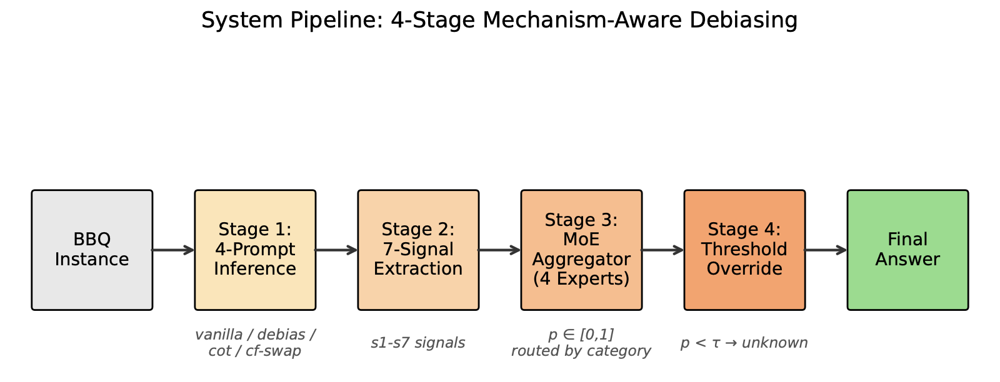

# Condition-Aware Selective Abstention on BBQ

[](https://github.com/KMS-gif375/LLM-Bias-Mitigation/releases/tag/v1.1.0)
[](https://doi.org/10.5281/zenodo.21839822)
[](LICENSE)

Official reproducibility artifact for **"Condition-Aware Selective Abstention on the Bias Benchmark for Question Answering: A Multi-Signal Audit of BBQ Condition Separability."** The system keeps the language model frozen, predicts whether each Bias Benchmark for Question Answering (BBQ) item is ambiguous or disambiguated, and applies a condition-aware keep/unknown policy without oracle condition labels at test time.

The main empirical result is a benchmark audit: the original clean BBQ split is highly condition-separable, so a simple condition-only policy explains most of the clean-split gain. The seven-signal mixture-of-experts (MoE) is retained as a diagnostic and as a fallback under limited condition supervision; it is not claimed to outperform condition-only abstention on the clean split.

> **Version note:** tag `v1.1.0` is the immutable IEEE Access submission artifact. Later commits on `main` may improve repository documentation and organization without changing that archived experiment or manuscript snapshot.

## Artifact links

- [GitHub release v1.1.0](https://github.com/KMS-gif375/LLM-Bias-Mitigation/releases/tag/v1.1.0): final PDF, LaTeX source, replay assets, and SHA-256 manifest
- [Final manuscript PDF](https://github.com/KMS-gif375/LLM-Bias-Mitigation/releases/download/v1.1.0/CASA_IEEE_Access_v1.1.0.pdf)
- [Zenodo v1.1.0](https://doi.org/10.5281/zenodo.21839822): immutable version DOI
- [Zenodo concept DOI](https://doi.org/10.5281/zenodo.20621245): version-independent artifact record
- [Full reproduction map](REPRODUCING.md)
- [Canonical results map](results/README.md)

## Main findings

All values below are taken from the released five-seed artifacts unless stated otherwise. Higher ambiguous accuracy (`Acc_amb`) and disambiguated accuracy (`Acc_dis`) are better; lower false-abstention rate (`FAR`) is better.

| Policy | `Acc_amb` | `Acc_dis` | `FAR` | Interpretation |
|---|---:|---:|---:|---|
| Condition-only, corrected full features | **0.9994 +/- 0.0008** | **0.8786 +/- 0.0076** | **0.0729 +/- 0.0070** | Strongest clean-split operating point |
| Condition-only, embedding only | 0.9994 +/- 0.0008 | 0.8774 +/- 0.0082 | 0.0741 +/- 0.0083 | Nearly identical, with one primary generation plus one text embedding |
| Seven-signal MoE, predicted condition | 0.9937 +/- 0.0073 | 0.8753 +/- 0.0098 | 0.0822 +/- 0.0157 | Does not improve the corrected clean-split frontier |
| Template-disjoint condition-only | 0.9319 +/- 0.0214 | 0.7993 +/- 0.0216 | 0.1480 +/- 0.0272 | Performance drops when train and test share no template |

The context-question embedding alone predicts the clean BBQ condition with `0.9961 +/- 0.0023` accuracy. Word and character n-gram controls nearly match the neural encoders, while template-disjoint accuracy falls to `0.8874 +/- 0.0413`. These results support the structural-separability interpretation rather than a causal debiasing claim.

The fixed MoE is still useful in a narrower setting. When only 1% of condition-classifier training labels are used, the historical hybrid audit improves `Acc_dis` from `0.6786` to `0.8247` and reduces FAR from `0.2931` to `0.1452`. This fraction applies only to condition-classifier training labels: the MoE and validation set remain fully supervised, as documented in [REPRODUCING.md](REPRODUCING.md).

## System overview



The low-cost path uses one primary generation and a context-question embedding. The full diagnostic path additionally evaluates four prompt views and seven signals:

| Signal | Diagnostic quantity |
|---|---|
| `s1_evidence` | Whether a supporting quote can be matched to the context |
| `s2_counterfactual` | Stability under demographic substitution and option-order perturbation |
| `s3_confidence` | Chosen-answer log-probability confidence |
| `s4_consistency` | Agreement across repeated samples |
| `s5_bias_head` | Attention from a fixed diagnostic head set to demographic tokens |
| `s6_prompt_sensitivity` | Agreement across prompt views |
| `s7_sae_feature` | Activation of a fixed Llama-Scope sparse-autoencoder feature set |

The internal signals are diagnostic inputs. The release does not claim that any single attention head or sparse-autoencoder feature causally explains bias mitigation.

## Choose a reproduction path

| Goal | New LLM inference | Hardware | Start here |
|---|---:|---|---|
| Inspect reported metrics and tables | No | CPU | Saved CSV/JSON under `results/` |
| Replay checkpoint/embedding analyses | No | CPU; GPU optional | Download the replay archive below |
| Regenerate all seven signals | Yes | CUDA GPU and gated Llama access | `run_pipeline.py` and [REPRODUCING.md](REPRODUCING.md) |

### Environment and tests

```bash
git clone https://github.com/KMS-gif375/LLM-Bias-Mitigation.git
cd LLM-Bias-Mitigation
python3 -m venv .venv
source .venv/bin/activate
pip install -r requirements.txt
pytest -q
```

Regenerating Llama-based signals requires access to `meta-llama/Llama-3.1-8B-Instruct`, an `HF_TOKEN` in a local `.env`, and a suitable GPU. Credentials and gated model weights are not distributed in this repository.

### Released replay assets

Binary embeddings and validation-best checkpoints are distributed separately because of their size. From the repository root:

```bash
BASE=https://github.com/KMS-gif375/LLM-Bias-Mitigation/releases/download/v1.1.0
curl -fL "$BASE/CASA_replay_assets_v1.1.0.tar.gz" \
  -o CASA_replay_assets_v1.1.0.tar.gz
curl -fL "$BASE/SHA256SUMS.txt" -o SHA256SUMS.txt

# Linux:
grep 'CASA_replay_assets_v1.1.0.tar.gz' SHA256SUMS.txt | sha256sum -c -
# macOS:
# grep 'CASA_replay_assets_v1.1.0.tar.gz' SHA256SUMS.txt | shasum -a 256 -c -

tar -xzf CASA_replay_assets_v1.1.0.tar.gz

# Verify all extracted checkpoints and embeddings (Linux):
sha256sum -c REPLAY_ASSET_SHA256SUMS.txt
# macOS:
# shasum -a 256 -c REPLAY_ASSET_SHA256SUMS.txt
```

The archive restores repository-relative paths, including `results/v2_runpod/moe/main/moe_best.pt` and the saved embeddings used by artifact-only replay commands. It contains no credentials or private raw data.

## Repository layout

| Path | Contents |
|---|---|
| `run_pipeline.py` | End-to-end BBQ pipeline entry point |
| `src/signals/` | Seven-signal extraction |
| `src/models/` | Condition classifier, MoE, and override policy |
| `src/analysis/` | Multi-seed, ablation, routing, and plotting utilities |
| `src/transfer/` | Open-BBQ, KoBBQ, StereoSet, and WinoGender audits |
| `scripts/` | Reproduction and post-audit correction scripts |
| `results/` | Tracked summaries, predictions, and provenance records; see [results/README.md](results/README.md) |
| `paper/ieee_access/` | Final English LaTeX source and compiled manuscript |
| `docs/figures/` | PNG previews used by this README |

## Interpretation boundaries

This artifact supports a structural audit of BBQ and a no-oracle deployment policy. It does not establish that:

- the seven-signal MoE universally improves over condition-only abstention;
- any individual SAE feature or attention head causes debiasing;
- the limited-overlap FairSteer audit is a full protocol comparison;
- deterministic template rewrites constitute human-verified paraphrase robustness; or
- the English condition classifier transfers reliably across languages or free-form QA tasks.

Residual ambiguous-bias estimates are unstable when almost every ambiguous item is converted to the unknown answer because very few non-unknown predictions remain in the denominator.

## Data and licenses

The source code is released under the [MIT License](LICENSE). Third-party datasets and model artifacts remain subject to their original licenses and terms, including BBQ (CC BY 4.0), Open-BBQ (CC BY 4.0), KoBBQ (CC BY-SA 4.0), the Meta Llama license, and the licenses attached to Qwen and Mistral. The repository license does not relicense those third-party materials.

## Citation

For the immutable `v1.1.0` artifact, cite the version DOI below. Use the concept DOI (`10.5281/zenodo.20621245`) when referring to the evolving artifact family.

```bibtex
@software{kim_casa_2026,
  author    = {Mose Kim and Suhyun Kwon and Jinho Lee},
  title     = {Condition-Aware Selective Abstention on the Bias Benchmark for Question Answering: A Multi-Signal Audit of BBQ Condition Separability},
  version   = {1.1.0},
  year      = {2026},
  publisher = {Zenodo},
  doi       = {10.5281/zenodo.21839822},
  url       = {https://doi.org/10.5281/zenodo.21839822}
}
```
